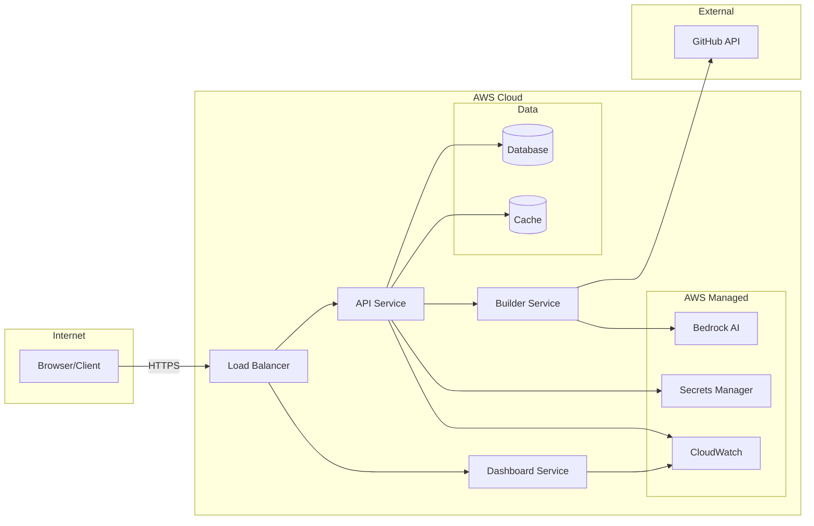
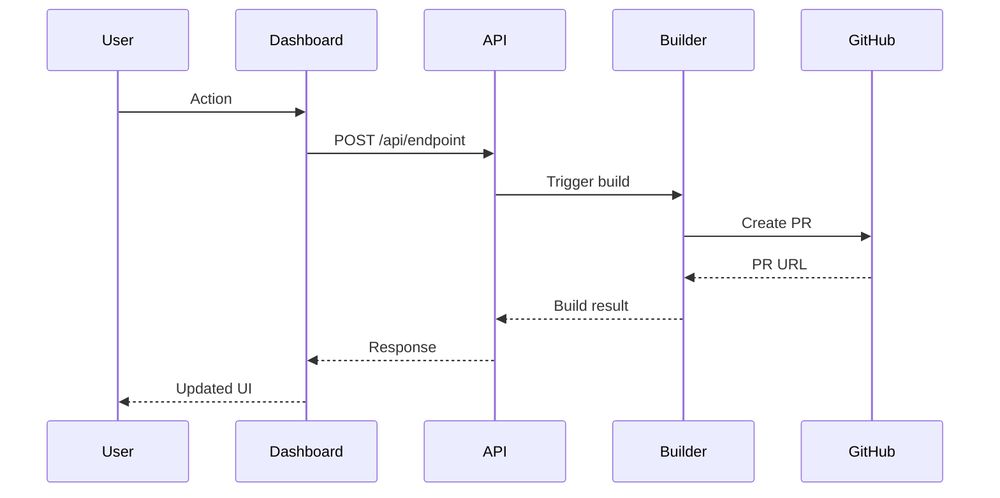
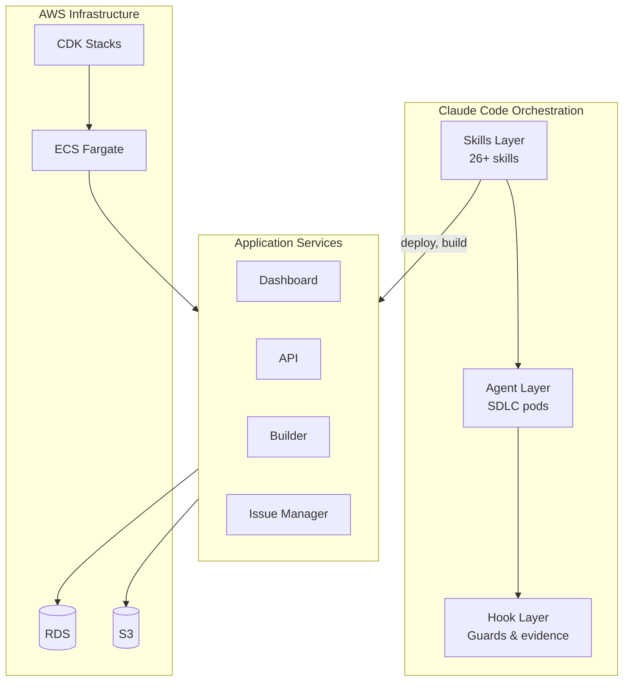
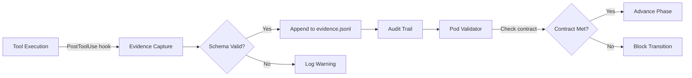
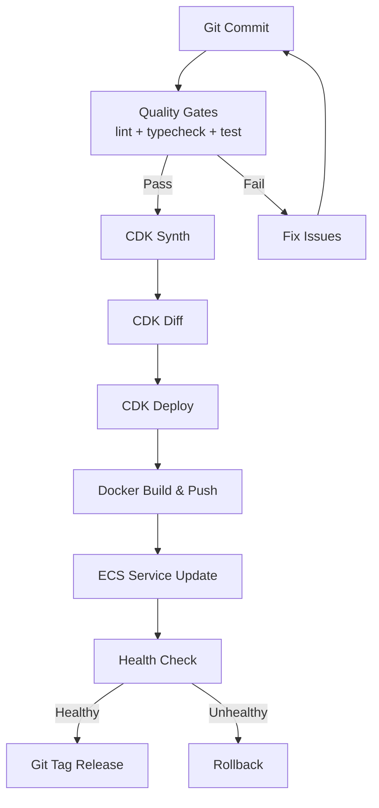
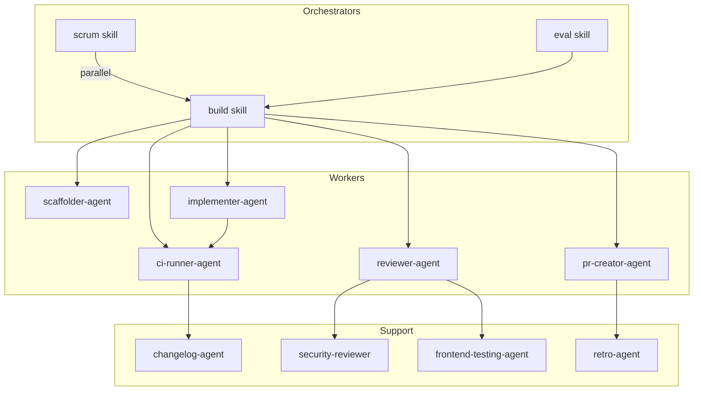
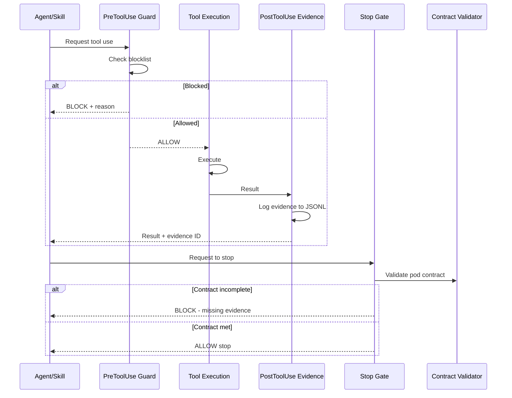

# Feature Atlas - Tiered Documentation System

> **Configuration**: Read `.claude/project.config.json` for `paths.atlas_dir`, `paths.atlas_features_dir`, `paths.atlas_tiers.*`, and `context_files` to resolve all documentation paths below. Substitute `docs/atlas/` with the configured atlas directory path.

This skill generates and maintains structured documentation across a 5-tier hierarchy that helps AI understand not just WHAT the code does, but WHY it exists and what "correct" behavior means.

## When to Use This Skill

- "Document this feature"
- "Update the feature atlas"
- "Sync documentation with codebase"
- "Clean up stale docs"
- "Generate diagrams" / "Update diagrams"
- "Show me the network flow"
- "Why was X built this way?"
- "What are the invariants for Y?"
- Starting significant work that requires codebase understanding

---

## Documentation Hierarchy

```
docs/atlas/
├── README.md                           # Main entry point & navigation
│
├── tier1-strategic/                    # Rarely change, govern everything
│   ├── 01-product-vision.md            # Vision, goals, anti-goals
│   ├── 02-business-requirements.md     # Business capabilities & rules
│   ├── 03-enterprise-principles.md     # Non-negotiable tech principles
│   ├── 04-security-policy.md           # Security requirements
│   └── 05-compliance-requirements.md   # Regulatory compliance
│
├── tier2-architecture/                 # Change with major releases
│   ├── 01-system-architecture.md       # High-level system structure
│   ├── 02-aws-infrastructure.md        # AWS-specific architecture
│   ├── 03-data-architecture.md         # Data models & flows
│   └── 04-security-architecture.md     # Security patterns
│
├── tier3-design/                       # Change with features
│   ├── 01-domain-model-specification.md    # Domain entities & events
│   ├── 02-api-contract.md                    # Primary API contract
│   ├── 03-frontend-service-design.md         # Frontend service design
│   ├── 04-backend-service-design.md          # Backend service design
│   └── 05-additional-service-design.md       # Additional services
│
├── tier4-implementation/               # Change frequently
│   ├── 01-feature-specification-template.md   # FS template
│   ├── 02-technical-task-specification.md     # TTS template
│   ├── 03-test-specification.md               # Test patterns
│   ├── 04-runbook-operations.md               # Operational procedures
│   └── 05-feature-examples/                   # Example specs
│
├── tier5-reference/                    # Living documents
│   ├── 01-golden-commands.md           # Essential commands
│   ├── 02-system-map.md                # Auto-generated system map
│   ├── 03-glossary-terminology.md      # Ubiquitous language
│   ├── 04-decision-log.md              # ADR index
│   └── 05-code-standards.md            # Code conventions
│
├── diagrams/                           # Mermaid diagrams (auto-generated)
│   ├── network-flow.md                 # Service-to-service & external traffic
│   ├── system-architecture.md          # High-level component topology
│   ├── sdlc-workflow.md                # SDLC state machine & pod transitions
│   ├── data-flow.md                    # Data pipelines & evidence flow
│   ├── deployment-pipeline.md          # CI/CD & infrastructure deployment
│   ├── agent-orchestration.md          # Skill/agent dependency graph
│   └── hook-pipeline.md               # Hook execution sequence
│
├── features/                           # Living feature documentation
│   ├── feature-a.md
│   ├── feature-b.md
│   └── ... (one per feature)
│
└── decisions/                          # Architecture Decision Records
    ├── ADR-001-example-decision.md
    └── ADR-002-another-decision.md
```

---

## Documentation Sync Process

When asked to sync documentation, perform these operations:

### 1. Atlas → Codebase (Remove Stale Atlas Features)

**Goal**: Remove atlas feature docs that no longer have corresponding code.

**Process**:
1. List all files in `docs/atlas/features/`
2. For each feature doc, extract the "Key Components" or file paths mentioned
3. Check if those files/directories still exist in the codebase
4. If >50% of referenced paths are missing, flag for removal
5. Delete the feature doc and report what was removed

### 2. Codebase → Atlas (Add Missing Atlas Features)

**Goal**: Create atlas feature docs for code that has no documentation.

**Process**:
1. Scan key directories for features (read directory paths from `.claude/project.config.json` under `paths.*`):
   - Application routes and pages (e.g., `src/app/`, `src/pages/`)
   - Feature-specific components or modules
   - Service/backend subsystems
   - Utilities with distinct functionality
2. For each discovered feature, check if a corresponding doc exists in the configured atlas features directory
3. If missing, create a new feature doc using the template below
4. Populate with information extracted from the code

**Feature discovery patterns** (adapt paths to your project structure):
```
src/app/costs/           → {atlas_features_dir}/costs.md
src/app/metrics/         → {atlas_features_dir}/metrics.md
services/scanner.py      → {atlas_features_dir}/scanner.md
lib/runtime.py           → {atlas_features_dir}/runtime.md
```

### 3. Refresh Tier 5 Reference Docs

**Goal**: Keep system map and glossary current.

**Process**:
1. Regenerate `tier5-reference/02-system-map.md` from codebase scan
2. Update route tables, module lists, API endpoints
3. Add new terms to glossary when discovered
4. Update decision log with any new ADRs

### 4. Validate Tier Structure

**Goal**: Ensure tiered docs reference each other correctly.

**Process**:
1. Check Tier 1 docs exist and are current
2. Verify Tier 2 docs align with Tier 1 principles
3. Confirm Tier 3 docs implement Tier 2 architecture
4. Ensure Tier 4 templates are ready for new features

---

## Feature Documentation Template

Each feature doc (`docs/atlas/features/*.md`) should follow this structure:

```markdown
# Feature: [Name]

## Purpose
What problem does this solve? Who is it for?

## Key Files
| File | Purpose |
|------|---------|
| `path/to/file.ts` | Description |
| `path/to/component.tsx` | Description |

## UI Entry Points
- Routes: `/feature-path`
- Navigation: Sidebar > Feature Name

## Data Flow
1. User action triggers...
2. API call to...
3. Data stored in...

## Configuration
- Environment variables: `FEATURE_VAR`
- Config files: `config/feature.json`

## Business Rules & Invariants
1. Rule one
2. Rule two

## Related Features
- [Other Feature](./other-feature.md)

## Related Tier Docs
- [Service Design](../tier3-design/XX-service-design.md)
- [API Contract](../tier3-design/02-dashboard-api-contract.md)

## Version History
| Version | Changes |
|---------|---------|
| 1.0.0 | Initial implementation |
```

---

## Mermaid Diagram Generation

All diagrams live in `docs/atlas/diagrams/` as markdown files containing Mermaid code blocks. Each file should have a title, description, and one or more ```` ```mermaid ```` blocks.

### Diagram Types

#### 1. Network Flow (REQUIRED) — `network-flow.md`

Maps service-to-service communication, external integrations, and traffic patterns. This is the primary diagram and must always be generated.

**What to scan for**:
- API endpoints (REST routes, GraphQL schemas)
- Service-to-service calls (HTTP, gRPC, SDK clients)
- External integrations (AWS services, GitHub API, third-party APIs)
- Database connections
- Message queues / event buses (SNS, SQS, EventBridge)
- CDN / load balancer / reverse proxy configuration
- Environment variables referencing URLs or service endpoints

**Template**:
````markdown
# Network Flow

Service-to-service communication and external traffic patterns.

## Service Topology



## Request Flow — [Feature Name]


````

**Generation rules**:
1. Scan all source files for HTTP clients, fetch calls, SDK instantiations, and connection strings
2. Scan IaC (CDK, CloudFormation) for VPC, security groups, load balancers, and service definitions
3. Scan `project.config.json` for declared services and endpoints
4. Include port numbers and protocols where discoverable
5. Separate internal traffic (service mesh) from external traffic (internet-facing)
6. Add sequence diagrams for critical request paths (auth, data mutation, deployment)

---

#### 2. System Architecture — `system-architecture.md`

High-level component topology showing how services, infrastructure, and tools relate.

**Template**:
````markdown
# System Architecture


````

---

#### 3. SDLC Workflow — `sdlc-workflow.md`

State machine showing work item progression through pods.

**Template**:
````markdown
# SDLC Workflow

```mermaid
stateDiagram-v2
    [*] --> Intake
    Intake --> Definition: Contract signed
    Definition --> Build: DoR approved
    Build --> Release: Tests pass + review
    Release --> Operate: Deployed + verified
    Operate --> [*]: Monitoring confirmed

    state Intake {
        [*] --> Triage
        Triage --> Acceptance_Criteria
        Acceptance_Criteria --> Intake_Contract
    }

    state Definition {
        [*] --> Design
        Design --> Plan
        Plan --> Test_Plan
        Test_Plan --> Definition_Contract
    }

    state Build {
        [*] --> Implementation
        Implementation --> Code_Review
        Code_Review --> Testing
        Testing --> Build_Contract
    }

    state Release {
        [*] --> Release_Plan
        Release_Plan --> Deploy
        Deploy --> Smoke_Test
        Smoke_Test --> Release_Contract
    }

    state Operate {
        [*] --> Runbook
        Runbook --> Monitoring
        Monitoring --> Operate_Contract
    }
```


````

---

#### 4. Data Flow — `data-flow.md`

How data moves through the system — evidence pipeline, work item lifecycle, API data.

**Template**:
````markdown
# Data Flow

## Evidence Pipeline


````

---

#### 5. Deployment Pipeline — `deployment-pipeline.md`

CI/CD flow from commit to production.

**Template**:
````markdown
# Deployment Pipeline


````

---

#### 6. Agent Orchestration — `agent-orchestration.md`

Shows which skills invoke which agents and their dependencies.

**Template**:
````markdown
# Agent Orchestration


````

---

#### 7. Hook Pipeline — `hook-pipeline.md`

Sequence of hook execution during tool use.

**Template**:
````markdown
# Hook Execution Pipeline


````

---

### Diagram Sync Rules

During atlas sync, diagrams are regenerated from the codebase:

1. **SCAN**: Discover services, endpoints, integrations, IaC, hooks, agents, and data paths
2. **DIFF**: Compare discovered topology against existing diagrams
3. **UPDATE**: Regenerate diagrams where the codebase has diverged
4. **VALIDATE**: Ensure all nodes in diagrams reference real code artifacts
5. **REPORT**: List diagram changes in the sync report

**Staleness detection**:
- If a service/endpoint in a diagram no longer exists in code, remove it
- If a new service/endpoint exists in code but not in diagrams, add it
- If IaC changes (new stacks, removed resources), update architecture and network flow

**When to generate which diagram**:

| Trigger | Diagrams to Update |
|---------|-------------------|
| New service added | network-flow, system-architecture |
| New API endpoint | network-flow, data-flow |
| SDLC workflow change | sdlc-workflow |
| New skill/agent added | agent-orchestration |
| Hook modified | hook-pipeline |
| IaC / deploy change | deployment-pipeline, network-flow |
| Full sync | All diagrams |

---

## Creating New Feature Specifications

When a new feature needs formal specification, use the Tier 4 templates:

### 1. Feature Specification (FS)

Use `tier4-implementation/01-feature-specification-template.md` to create:
`tier4-implementation/05-feature-examples/FS-XXX-feature-name.md`

### 2. Technical Task Specification (TTS)

Break down the FS into granular tasks using:
`tier4-implementation/02-technical-task-specification.md`

Each TTS should be:
- Completable in a single PR
- AI-executable without ambiguity
- Linked to acceptance criteria

### 3. Test Specification

Define test requirements using patterns from:
`tier4-implementation/03-test-specification.md`

---

## Sync Commands

When asked to sync, run these operations in order:

```
1. SCAN: Discover all features in codebase
2. COMPARE: Match against existing atlas docs
3. REMOVE: Delete atlas docs for removed features
4. ADD: Create atlas docs for new features
5. DIAGRAMS: Regenerate Mermaid diagrams from codebase (network-flow always)
6. UPDATE: Refresh tier5 reference docs (system-map, glossary)
7. VALIDATE: Check tier cross-references & diagram node validity
8. REPORT: Summary of changes made (including diagram diffs)
```

### Output Format

After sync, provide a summary:

```markdown
## Documentation Sync Report

### Tier Status
- Tier 1 (Strategic): 5 docs, all current
- Tier 2 (Architecture): 4 docs, all current
- Tier 3 (Design): 5 docs, all current
- Tier 4 (Implementation): 5 docs + examples
- Tier 5 (Reference): 5 docs, refreshed

### Feature Docs Changed

#### Removed (Stale)
- `docs/atlas/features/old-feature.md` - Code no longer exists

#### Added (New)
- `docs/atlas/features/new-feature.md` - New feature in dashboard/src/app/new/

#### Updated
- `docs/atlas/features/existing.md` - Added new components

### Diagrams Updated
- `network-flow.md` - Added Builder→Bedrock edge, removed stale cache node
- `agent-orchestration.md` - Added new eval skill connections
- `deployment-pipeline.md` - No changes (current)

### Reference Docs Refreshed
- System map: +3 routes, +2 API endpoints
- Glossary: +1 new term

### Unchanged
- 30 feature docs still current
```

---

## Instructions for AI

When executing this skill:

### For Documentation Sync:
1. **Scan codebase** for all features (routes, components, services)
2. **Compare** against existing docs in `docs/atlas/features/`
3. **Remove** docs where >50% of referenced files no longer exist
4. **Add** docs for features missing documentation
5. **Generate diagrams** — always regenerate `network-flow.md`, update others as needed
6. **Refresh** tier5 reference documents
7. **Validate** tier cross-references and diagram node validity
8. **Report** all changes made (including diagram additions/changes)

### For New Feature Documentation:
1. **Check tier3** for existing service design patterns
2. **Use tier4 templates** for formal specifications
3. **Create feature doc** in `docs/atlas/features/`
4. **Link to related tiers** for full context

### For Diagram Generation:
1. **Scan codebase** for services, endpoints, IaC, hooks, agents, data paths
2. **Network flow is mandatory** — always generate `docs/atlas/diagrams/network-flow.md`
3. **Generate additional diagrams** based on what changed or was requested
4. **Validate every node** in the diagram references a real code artifact
5. **Use proper Mermaid syntax** — test that diagrams render correctly
6. **Keep diagrams focused** — split large diagrams into sub-diagrams rather than one giant graph
7. **Add sequence diagrams** for critical request paths within network-flow.md

### For Architecture Questions:
1. **Start at Tier 1** for strategic context
2. **Check Tier 2** for architectural decisions
3. **Review Tier 3** for service-specific patterns
4. **Reference Tier 5** for current system state

### Truth Hierarchy:
1. **Code** is the source of truth for WHAT exists
2. **Tests** are the source of truth for expected BEHAVIOR
3. **Tier 3-4 docs** explain HOW components work
4. **Tier 5 docs** provide CONTEXT and WHY
5. If docs conflict with code, update the docs (not the other way around)

---

## Quick Reference

### Finding Information

| Question | Start Here |
|----------|------------|
| What is the product vision? | `tier1-strategic/01-product-vision.md` |
| What infrastructure do we use? | `tier2-architecture/02-infrastructure.md` |
| How does the frontend work? | `tier3-design/03-frontend-service-design.md` |
| What are the API endpoints? | `tier3-design/02-api-contract.md` |
| How do I implement a feature? | `tier4-implementation/01-feature-specification-template.md` |
| What commands should I run? | `tier5-reference/01-golden-commands.md` |
| Where is file X? | `tier5-reference/02-system-map.md` |
| What does term Y mean? | `tier5-reference/03-glossary-terminology.md` |
| How do services communicate? | `diagrams/network-flow.md` |
| What's the system topology? | `diagrams/system-architecture.md` |
| How does the SDLC flow work? | `diagrams/sdlc-workflow.md` |
| How is data processed? | `diagrams/data-flow.md` |
| How does deployment work? | `diagrams/deployment-pipeline.md` |
| Which agents call which? | `diagrams/agent-orchestration.md` |

### Key Principles

1. **Hierarchical Flow**: Documents progress from strategic to tactical
2. **AI-Readable Formats**: YAML structure enables parsing
3. **Traceability**: Every implementation traces to business needs
4. **Completeness**: Sufficient detail minimizes AI interpretation errors
5. **Consistency**: Glossary ensures uniform patterns