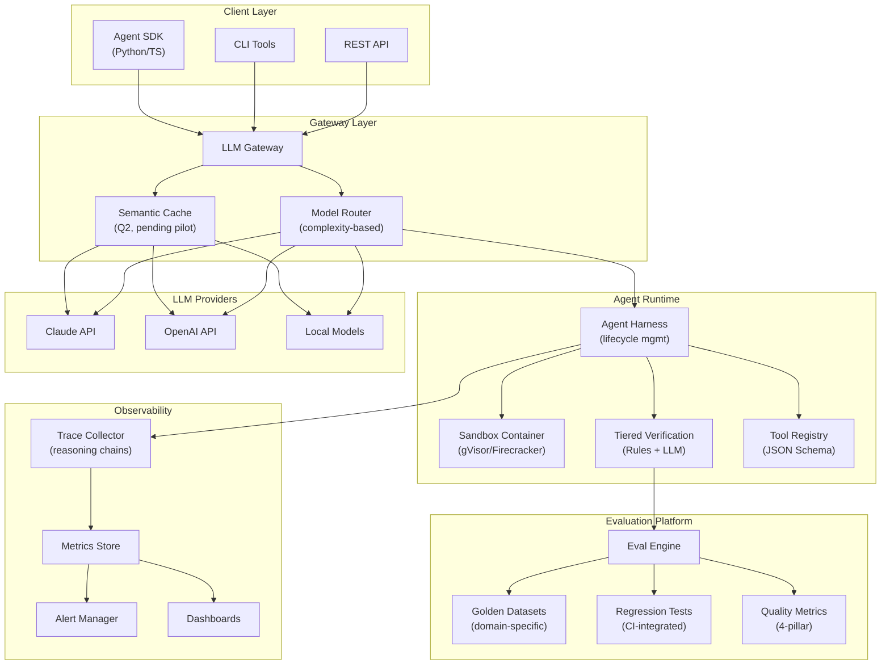

# VP Engineering Strategy Report (2026-02-24)

## 0) Executive Summary

- **Reliability as differentiator**: In a crowded AI tooling market where 32% of organizations cite quality issues as their primary production barrier, we will build the most reliable AI agent platform by investing in self-verification, comprehensive evals, and production-grade observability.
- **Revised Q1 scope**: Focused MVP delivering Agent Harness + Eval Foundation in 3 months with 8 engineers (reduced from 4 parallel systems to 2 core systems after challenger critique).
- **Tiered verification architecture**: Rules-based verification (catching 80% of issues with <50ms overhead) as default, LLM-based verification reserved for high-stakes/low-confidence outputs only.
- **Cost/latency strategy**: Model routing + semantic caching targeting 30% cost reduction (revised from 40% to account for verification overhead), with caching dependent on Q1 pilot validation.
- **12-month path to enterprise**: Q1 MVP → Q2 production hardening → Q3 multi-agent orchestration → Q4 SOC2 prep and enterprise pilots.

## 1) Context

### 1.1 Company Goal + Constraints

**Goal**: Evolve our existing Enkai AI feature-building platform into a production-grade AI agent reliability framework that differentiates us in a crowded market.

**Current portfolio**: 31 GitHub repos (16 active), anchored by the **Enkai platform** (6 repos) — an AI-powered system that transforms GitHub issue specs into production-ready PRs via an automated pipeline (issue-manager → SQS → builder → PR). Supporting tools include frank (container runtime), pedro (skills framework), metis (dev toolkit), and template-factory (scaffolding) [15][17].

**Constraints**:
- Budget: $500K engineering spend for Q1
- Team: 8 engineers (4 senior, 4 mid-level) — currently have 6, hiring 2 (1 ML/LLM specialist, 1 infra)
- Timeline: MVP in 3 months
- Current stack: TypeScript (dominant, 12 repos), Python (8 repos, core agent logic), Go (frank container runtime), AWS CDK (30 infrastructure stacks), Next.js, FastAPI, ECS Fargate, DynamoDB, SQS, Bedrock AgentCore [15]
- Technical debt: Schema drift across 3 repos, shared_types duplication, incomplete monorepo extraction, split CI/CD (GitHub Actions + CodeBuild + no CI) [16]

### 1.2 Market Signals (Cited)

The AI agent market in 2026 is characterized by widespread adoption with persistent quality challenges:

- **89% of organizations have implemented observability** for their agents, yet **32% still cite quality issues** as their primary production barrier [1]. The gap is not in monitoring but in the agent runtime itself.

- **Traditional monitoring is insufficient**: AI agents fail in subtle ways—hallucinations, skipped steps, context errors—that traditional uptime monitoring won't catch [2]. Agent-specific observability must trace multi-step reasoning chains and evaluate output quality.

- **Amazon's 4-pillar evaluation framework** has emerged as an industry standard: quality (reasoning coherence, tool selection accuracy), performance (latency, throughput), responsibility (safety, bias mitigation), and cost [3].

- **Self-verification is the emerging reliability pattern**: "Agents that can check and improve their own output are fundamentally more reliable—they catch mistakes before they compound, self-correct when they drift" [4]. The Claude Agent SDK emphasizes artifact persistence and incremental progress.

- **Cost optimization is achievable**: Teams commonly cut LLM spend by 30-50% through basic routing, semantic caching (96.9% latency reduction on cache hits, 60-85% hit rates for repetitive workloads), and prompt optimization [5][6].

- **Mature tooling ecosystem exists**: Maxim (end-to-end observability), Arize (drift detection), Langfuse (developer-first tracing), DeepEval (code-driven automation) are all production-ready options [7].

### 1.3 Pnyx Community Signals

Community patterns from agent practitioners reinforce our strategy:

- **Machine-checkable gates catch 80% of quality issues**; remaining 20% requires LLM evaluation. This validates our tiered verification approach with rules-based checks as the default layer.

- **Git worktree isolation is proven for parallel agent execution**, enabling multiple agents to operate concurrently without conflicts—relevant for our multi-agent orchestration roadmap.

- **Structured JSON Schema contracts reduce integration failures**, aligning with Amazon's tool schema standardization recommendation.

- **Quality gates should be self-healing with automated fix loops** before escalating to human intervention—incorporated into our eval framework design.

### 1.4 Internal Platform Assessment

An analysis of the tegryan-ddo GitHub organization (31 repos, 16 active) reveals a substantial existing platform that the strategy must build upon rather than start from scratch [15][16][17].

**Enkai Platform Architecture (6 repos)**:

The core pipeline is already operational: GitHub webhooks trigger `enkai-issue-manager`, which analyzes and decomposes issues, then dispatches jobs via SQS to `enkai-builder`. The builder — the largest Python codebase at 6.3MB — uses Bedrock AgentCore to generate code and create PRs. `enkai-monitor` provides a TypeScript dashboard, and `enkai-infra` manages all AWS resources through 30 CDK stacks (VPC, ECS, DynamoDB, SQS, S3, Route53, Cognito, IAM, secrets, logging, and more) [15].

**Supporting Ecosystem (6 repos)**:

- **frank** (Go): Container runtime managing ECS Fargate instances for AI coding agents with web UI and worktree isolation
- **pedro** (Python): Skills framework providing 30+ reusable agent capabilities consumed by frank containers at startup
- **metis** (TypeScript/Python): AI-powered dev toolkit for code analysis and quality checking
- **template-factory** (TypeScript): Project scaffolding from templates, built on Pedro framework
- **janus**: Planned deployment orchestration service (repo created but empty)
- **brandassador** (TypeScript): Brand management tooling (18 open issues — most active backlog)

**Key Strengths Discovered**:
- Formal JSON Schema contracts for inter-service communication (9+ schemas in enkai-builder)
- Comprehensive CDK infrastructure: 30 stacks in enkai-infra with tiered resource management
- Bedrock AgentCore integration for AI agent orchestration
- SQS-based async architecture providing natural backpressure and decoupling
- Pedro skills ecosystem enabling reusable, composable agent capabilities

**Key Risks Discovered** [16]:
- **Schema drift**: JSON schemas defined independently in enkai, enkai-builder, and enkai-issue-manager with no shared registry or version management
- **shared_types duplication**: Python type definitions copy-pasted between enkai-builder and enkai-issue-manager; changes require manual synchronization
- **Incomplete monorepo extraction**: enkai still contains `infra/cdk` and `dashboard/` directories despite enkai-infra and enkai-monitor existing as separate repos — unclear which copy is authoritative
- **Split CI/CD**: GitHub Actions in enkai (5 workflows), CodeBuild in enkai-issue-manager and enkai-infra, no CI in 7 active repos including enkai-builder
- **Bus factor**: enkai-builder and enkai-issue-manager each have a single contributor
- **Janus empty**: Deployment orchestration planned but not started

## 2) Current Strategy

### 2.1 North Star + Strategic Bets

**North Star**: Build the most reliable AI agent platform in the market, where reliability is the primary differentiator.

**Foundation**: These bets build upon the existing Enkai platform, which already implements the core agent pipeline (issue analysis → decomposition → code generation → PR creation) with 30 CDK infrastructure stacks and Bedrock AgentCore integration [15]. The strategic work is to harden this foundation into a production-grade, multi-tenant reliability platform.

**Strategic Bets** (prioritized):

| Bet | Investment | Success Criteria |
|-----|------------|------------------|
| **Reliability-First Agent Framework** | Critical | Task completion >95%, self-correction catches >80% of errors, zero runaway incidents |
| **Comprehensive Evaluation Platform** | Critical | 100% behavior coverage, automated regression in CI, quality score on every deploy |
| **Proprietary Eval Datasets** | High | Domain-specific golden datasets that competitors cannot easily replicate |
| **Production Observability Stack** | High | Full trace visibility, <5min MTTR, real-time cost tracking |
| **Cost/Latency Optimization Layer** | Medium | 30% LLM spend reduction, P95 <2s, >40% cache hit rate |

### 2.2 Engineering Principles

1. **Reliability over features**: Ship less, but ship reliable
2. **Eval-driven development**: No feature ships without eval coverage
3. **Self-verification by default**: Agents check their own work before completion
4. **Observable by design**: Every agent action is traceable and auditable
5. **Fail gracefully**: Defined termination conditions and fallback behaviors
6. **Cost-aware**: Model routing and caching are first-class concerns

### 2.3 What We Will NOT Do

- We will NOT chase feature parity with every competitor
- We will NOT sacrifice reliability for speed-to-market on new capabilities
- We will NOT build monolithic agents; prefer composable, testable units
- We will NOT rely solely on prompt engineering; invest in structured evaluation
- We will NOT optimize for demo-ware; optimize for production behavior
- We will NOT build Agent Marketplace in Year 1; focus on core platform

## 3) Technical Strategy

### 3.1 Platform Architecture

**Current State vs. Target**: The Enkai platform already implements several components mapped to the target architecture below [15]:

| Target Component | Current Implementation | Gap |
|-----------------|----------------------|-----|
| Agent Harness | enkai-builder (Bedrock AgentCore, lifecycle management) | Needs termination logic, self-verification, sandbox isolation |
| Tool Registry | enkai-builder schemas/ (9+ JSON Schema contracts) | Needs centralized registry, version management |
| Eval Engine | None | Full build required |
| Trace Collector | enkai-monitor (basic dashboard) | Needs reasoning chain tracing, Langfuse integration |
| LLM Gateway | None (direct Bedrock calls) | Full build required (Q2) |
| Sandbox | frank (ECS Fargate containers, worktree isolation) | Needs gVisor/Firecracker for multi-tenant |
| Orchestration | enkai-issue-manager → SQS → enkai-builder pipeline | Needs multi-agent coordination (Q3) |

**Key Components**:

| Component | Technology | Q | Notes |
|-----------|------------|---|-------|
| Agent Harness | Claude Agent SDK patterns (Python/TS) | Q1 | Core runtime, termination logic |
| Sandbox | gVisor (dev), Firecracker (multi-tenant prod) | Q1 | 2GB RAM, 1 vCPU, 60s max, no network default |
| Tiered Verification | Custom (rules engine + LLM fallback) | Q1/Q2 | Rules-based Q1, LLM-based Q2 |
| Eval Engine | DeepEval or custom | Q1 | CI-integrated from day 1 |
| LLM Gateway | Custom Go or LiteLLM | Q2 | Routing, caching, failover |
| Trace Collector | Langfuse integration | Q1 (basic), Q2 (full) | Reasoning chain visibility |

### 3.2 Agent Reliability & Evals

**Tiered Verification Architecture**:

| Tier | Mechanism | Latency | Coverage | Trigger |
|------|-----------|---------|----------|---------|
| **Tier 1** | Rules-based checks (syntax, schema, constraints) | <50ms | 100% of outputs | Always |
| **Tier 2** | LLM-based verification (semantic correctness) | 300-500ms | ~20% of outputs | Low confidence OR high stakes |

**Latency Budget**: Verification must not exceed 25% of base request latency.

**Behavior Taxonomy for Eval Coverage**:

1. **Tool Selection** — correct tool for task, proper parameter formatting
2. **Output Generation** — factual accuracy, format compliance, completeness
3. **Error Handling** — graceful degradation, retry logic, user-facing messages
4. **Termination Logic** — knows when to stop, avoids infinite loops
5. **State Management** — context preservation, artifact persistence

**Coverage Requirement**: Each behavior category must have:
- Unit tests for isolated behavior
- Integration tests for behavior in context
- Golden dataset examples for regression

**Quality Scoring** (pnyx-validated pattern):
- 4 dimensions: Completeness, Coherence, Specificity, Evidence Grounding (25 pts each)
- Pass threshold: 70/100
- Hard floor: 50/100 (below = automatic failure regardless of other checks)

### 3.3 Data & Knowledge Layer

**Golden Dataset Strategy**:
- Q1: Build foundational golden datasets for core behaviors (500+ examples)
- Q2: Domain-specific datasets for target verticals
- Q3: Community-contributed datasets with quality gates
- Ongoing: Automated dataset expansion from production successes

**Artifact Persistence**:
- All agent outputs stored with full provenance
- Artifacts are externally legible (readable by other agents or humans)
- State can be rehydrated for continuation from any checkpoint

### 3.4 Security, Compliance, Governance

**Sandbox Security Model**:
- **Isolation**: gVisor for lightweight development; Firecracker microVMs for multi-tenant production
- **Resource Limits**: 2GB RAM, 1 vCPU, 60s max execution time
- **Network**: Disabled by default; explicit allowlist for required endpoints
- **Data Access**: Scoped to task context; no persistent storage access without explicit grant
- **Threat Model**: Document in Q1 covering escape, resource exhaustion, data exfiltration vectors

**Compliance Path**:
- Q3: Enterprise features (SSO, audit logs)
- Q4: SOC2 Type 1 preparation
- Year 2: SOC2 Type 2, GDPR compliance

**Governance**:
- All agent executions logged with full trace
- Decision audit trail for compliance review
- Human-in-the-loop gates for high-stakes operations

### 3.5 Cost/Latency Strategy

**Model Routing Policy**:

| Task Type | Model | Rationale |
|-----------|-------|-----------|
| Simple queries, drafting | Claude Haiku / GPT-4o-mini | Cost-efficient for routine work |
| Complex reasoning, synthesis | Claude Opus / GPT-4 | Quality-critical tasks |
| Adversarial critique | GPT-5.2 Pro | Cross-model perspective |
| Verification (Tier 2) | Claude Haiku | Fast, sufficient for verification |

**Caching Strategy** (pending Q1 pilot validation):
- Semantic caching for repetitive query patterns
- Target: 40% hit rate (conservative until validated)
- Expected latency reduction on hit: ~97%
- TTL: 24 hours for research, 6 hours for dynamic queries

**Cost Targets**:
- 30% reduction vs. naive implementation (revised from 40% to account for verification overhead)
- Verification cost ratio: <20% of total LLM spend
- Per-request cost tracking and attribution

### 3.6 Technical Debt & Migration Plan

The internal platform assessment [16] identified five cross-cutting technical debt items that must be remediated to support the reliability strategy:

| Debt Item | Current State | Target State | Owner | Timeline |
|-----------|--------------|-------------|-------|----------|
| **Schema Registry** | JSON schemas duplicated in enkai, enkai-builder, enkai-issue-manager (3 independent copies) | Single source of truth: publish schemas as a versioned npm/pip package from enkai-infra, consumed by all services | Infra team | Q1 (Weeks 3-6) |
| **shared_types Extraction** | Python types copy-pasted between enkai-builder and enkai-issue-manager | Shared Python package in enkai-infra or standalone `enkai-types` repo; published to private PyPI | Backend team | Q1 (Weeks 4-6) |
| **CI/CD Consolidation** | GitHub Actions in enkai, CodeBuild in 2 repos, no CI in 7 repos | All repos on self-hosted GitHub Actions (aligns with enkai-infra issue #31) | DevOps | Q1 (Weeks 2-8) |
| **Monorepo Cleanup** | enkai retains `infra/cdk` and `dashboard/` despite enkai-infra and enkai-monitor existing | Remove duplicated directories from enkai; enkai-infra and enkai-monitor are authoritative | Backend team | Q1 (Weeks 2-4) |
| **Test Coverage** | Unknown — no CI enforcing coverage in most repos | 70% line coverage floor enforced in CI for all platform repos | All teams | Q2 |

**Dependency order**: Monorepo Cleanup → shared_types Extraction → Schema Registry → CI/CD Consolidation (CI must validate schemas and shared types).

## 4) 12-Month Roadmap

### Q1: Foundation (Weeks 1-12)

| Milestone | Description | Team | Deliverable |
|-----------|-------------|------|-------------|
| **Monorepo Cleanup** | Remove duplicate infra/cdk and dashboard/ from enkai; establish enkai-infra and enkai-monitor as authoritative [16] | 1 eng (backend, weeks 2-4) | Clean repo boundaries |
| **shared_types Extraction** | Extract shared Python types into versioned package; eliminate copy-paste between builder and issue-manager [16] | 1 eng (backend, weeks 4-6) | `enkai-types` package |
| **Schema Registry** | Publish JSON schemas as versioned package from enkai-infra; all services consume from single source [16] | 1 eng (infra, weeks 3-6) | Schema package + CI validation |
| **CI/CD Consolidation** | Migrate all repos to self-hosted GitHub Actions (aligns with enkai-infra #31) [16] | 1 eng (DevOps, weeks 2-8) | Unified CI/CD across all repos |
| **Agent Harness MVP** | Evolve enkai-builder into production harness with termination conditions, rules-based verification, artifact persistence | 4 eng (2 backend, 1 ML, 1 infra) | Production-ready harness |
| **Eval Foundation** | Behavior taxonomy, golden datasets (500+), CI-integrated quality metrics | 3 eng (1 ML, 1 backend, 1 DevOps) | Eval engine + regression suite |
| **Basic Tracing** | Evolve enkai-monitor into trace collector with Langfuse integration | 1 eng (infra) | Trace visibility |
| **Sandbox Security** | Threat model, gVisor integration, security review | (included in Harness) | Security spec + implementation |
| **Cache Pilot** | Benchmark semantic caching on sample traffic | 1 eng (infra, weeks 6-8) | Pilot results + go/no-go |

**Hiring**: 2 engineers by Week 4 (1 ML/LLM specialist, 1 infra)

### Q2: Production Hardening (Weeks 13-24)

| Milestone | Description | Team | Deliverable |
|-----------|-------------|------|-------------|
| **Test Coverage Floor** | Enforce 70% line coverage in CI for all platform repos [16] | All teams | Coverage gates in CI |
| **LLM Gateway** | Model routing, semantic caching (if pilot validates), failover | 2 eng | Production gateway |
| **Full Observability** | Reasoning chain viz, cost attribution, alert framework | 2 eng | Complete observability stack |
| **Self-Verification V2** | LLM-based verification for high-stakes, confidence routing | 2 eng | Tiered verification live |
| **SDK Release** | Python and TypeScript SDKs with full harness integration | 2 eng | Public SDK packages |

### Q3: Scale & Multi-Agent (Weeks 25-36)

| Milestone | Description | Team | Deliverable |
|-----------|-------------|------|-------------|
| **Multi-Agent Orchestration** | Coordination patterns, shared state, handoff protocols | 3 eng | Orchestration framework |
| **Simulation Testing** | Pre-production scenario simulation, persona-based testing | 2 eng | Simulation harness |
| **Advanced Eval** | LLM-evaluated quality scoring, cross-artifact consistency | 2 eng | Quality scoring system |
| **Enterprise Features** | SSO, audit logs, compliance reporting | 2 eng | Enterprise-ready |

### Q4: Enterprise Readiness (Weeks 37-48)

| Milestone | Description | Team | Deliverable |
|-----------|-------------|------|-------------|
| **Scale & Optimize** | Performance tuning, cost optimization, operational maturity | 3 eng | Production scale |
| **Platform Hardening** | Security audit, pen testing, SOC2 Type 1 prep | 2 eng | Security certification |
| **Enterprise Pilot Program** | 3-5 enterprise design partners | 2 eng | Customer validation |
| **Advanced Safety** | Behavioral testing, adversarial robustness | 2 eng | Safety suite |

## 5) Resourcing Plan

### Current Team (6 engineers)
- 2 Backend engineers (senior)
- 2 Backend engineers (mid)
- 1 Infrastructure engineer (senior)
- 1 DevOps engineer (mid)

### Q1 Hiring (2 engineers)
- **ML/LLM Specialist (senior)**: Critical for eval engine, LLM-based verification
- **Infrastructure Engineer (mid)**: Gateway, caching, observability

### Skill Matrix

| Role | Harness | Eval | Gateway | Observability | Sandbox |
|------|---------|------|---------|---------------|---------|
| Backend | Primary | Secondary | | | |
| ML/LLM | Secondary | Primary | | | |
| Infra | | | Primary | Primary | Primary |
| DevOps | | Secondary | | Secondary | |

### Org Design
- **Platform Team** (4 engineers): Harness, Gateway, Sandbox
- **Eval Team** (3 engineers): Eval engine, golden datasets, quality metrics
- **Infra Team** (3 engineers): Observability, DevOps, reliability

Reporting: All engineers report to VP Engineering with tech leads for each team emerging organically based on Q1 performance.

## 6) KPIs & Instrumentation

### Reliability KPIs

| Metric | Q1 Target | Q2 Target | Q4 Target |
|--------|-----------|-----------|-----------|
| Agent Task Completion Rate | 85% | 92% | 95% |
| Self-Correction Catch Rate | 60% | 75% | 80% |
| Runaway Agent Incidents | 0 | 0 | 0 |
| Eval Coverage (behavior taxonomy) | 70% | 90% | 100% |
| Mean Time to Detect (agent issues) | <15 min | <5 min | <2 min |

### Performance KPIs

| Metric | Q1 Target | Q2 Target | Q4 Target |
|--------|-----------|-----------|-----------|
| P95 Latency (standard ops) | <3s | <2.5s | <2s |
| Verification Overhead | <30% | <25% | <20% |
| Cache Hit Rate | N/A (pilot) | 40% | 50% |

### Cost KPIs

| Metric | Q1 Target | Q2 Target | Q4 Target |
|--------|-----------|-----------|-----------|
| Cost Reduction vs. Naive | 10% | 25% | 30% |
| Verification Cost Ratio | <25% | <20% | <15% |
| Cost per Successful Task | Baseline | -20% | -30% |

### Business KPIs

| Metric | Q2 Target | Q4 Target |
|--------|-----------|-----------|
| Enterprise Pilot Customers | 1 | 3-5 |
| Developer SDK Adoption | 50 devs | 200 devs |
| Production Workloads | 10K/day | 100K/day |

### Instrumentation Plan
- All metrics exported to Datadog/Prometheus
- Real-time dashboards for ops team
- Weekly metrics review in engineering standup
- Monthly metrics report to leadership

## 7) Risks & Mitigations

| Risk | Likelihood | Impact | Mitigation |
|------|------------|--------|------------|
| **MVP delay due to underestimated scope** | Medium | High | Ruthless Q1 scope reduction (done); bi-weekly milestone reviews; have scope cuts pre-identified |
| **Reliability differentiation erodes** | Medium | Critical | Build proprietary eval datasets; focus on domain-specific agents; invest in self-correction IP |
| **Security incident from sandbox escape** | Low | Critical | gVisor/Firecracker isolation; external security audit in Q1; threat model before launch |
| **Key person dependency (ML expertise)** | Medium | High | Hire 2nd ML engineer in Q2; document all ML decisions; cross-train team |
| **LLM provider pricing changes** | Medium | Medium | Multi-provider support; local model capability as hedge |
| **Semantic caching doesn't achieve target hit rates** | Medium | Medium | Pilot before committing; gateway architecture works without caching |
| **Enterprise sales cycle longer than expected** | Medium | Medium | Start pilot conversations Q2; focus on design partners who can move fast |
| **Schema drift causes cross-service failures** [16] | High | High | Establish schema registry in Q1 (weeks 3-6); publish versioned schema package from enkai-infra; add schema validation to CI |
| **shared_types divergence causes runtime errors** [16] | High | Medium | Extract shared_types into `enkai-types` package in Q1 (weeks 4-6); remove copy-pasted directories |
| **Incomplete monorepo extraction causes confusion** [16] | Medium | Medium | Remove duplicate infra/cdk and dashboard/ from enkai in Q1 (weeks 2-4); document authoritative repo ownership |
| **Bus factor on critical repos** [16] | Medium | High | Cross-train second engineer on enkai-builder and enkai-issue-manager by Week 8; require code review on all changes |

## 8) Decision Log

| ID | Decision | Rationale | Alternatives Considered | Status |
|----|----------|-----------|------------------------|--------|
| DEC-001 | Reduce Q1 scope to Harness + Eval only; defer Gateway to Q2 | 8 engineers cannot deliver 4 systems in parallel. Focus on core value first. | Hire more engineers; Deliver Gateway instead of Eval | Final |
| DEC-002 | Implement tiered verification (rules-based default, LLM-based for high-stakes) | Balances reliability with latency/cost. Rules-based catches 80% per pnyx data. | LLM-based for all; Rules-only | Final |
| DEC-003 | Maintain multi-provider strategy despite complexity | Single-provider lock-in is unacceptable business risk. JSON Schema contracts mitigate burden. | Claude-only; Primary + single fallback | Final |
| DEC-004 | Defer Agent Marketplace to Year 2 | Platform must be validated before building ecosystem | Simple templates in Q4; Partner marketplace | Final |
| DEC-005 | Use gVisor (dev) + Firecracker (prod) for sandbox | gVisor lighter for dev; Firecracker stronger for multi-tenant | Docker-only; Firecracker-only; Cloud Run | Provisional |
| DEC-006 | Set cache hit rate target at 40% until pilot validates | Published 60-85% rates are for FAQ-style workloads; agent workloads may differ | Assume 60% target; Skip caching | Provisional |
| DEC-007 | Complete monorepo-to-multirepo extraction in Q1; remediate schema drift and shared_types duplication before Q2 hardening | Internal assessment [16] identified cross-repo technical debt that undermines reliability goals. Must be addressed before adding new platform capabilities. | Defer to Q2; Accept duplication; Reconsolidate into monorepo | Final |

### Open Questions

1. **MVP Definition**: What specific capabilities would satisfy our first enterprise pilot customer?
2. **Customer Commitment**: Which customers have committed to pilot? (Need 1 confirmed for Q2)
3. **Fallback Plan**: If Q1 MVP slips by 4+ weeks, what is the contingency?
4. **Reliability Measurement**: How will customers verify our reliability claims? (Need external validation mechanism)
5. **EU AI Act**: What is our compliance position for agent systems? (Need legal review)

### Assumptions Requiring Validation

| Assumption | Confidence | Validation Method | Timeline |
|------------|------------|-------------------|----------|
| Claude/GPT APIs remain stable, pricing competitive | High | Monitor announcements | Ongoing |
| 8 engineers sufficient for Q1 MVP | Medium | Q1 velocity tracking | Week 4 |
| Semantic caching achieves 40%+ hit rates | Medium | Pilot study | Week 8 |
| Self-verification adds <25% latency | Medium | Benchmark during MVP | Week 6 |
| Enterprise customers pay premium for reliability | High | Customer discovery | Q2 |

## References

1. Braintrust. "5 best AI agent observability tools for agent reliability in 2026." https://www.braintrust.dev/articles/best-ai-agent-observability-tools-2026

2. UptimeRobot. "AI Agent Monitoring: Best Practices, Tools, and Metrics for 2026." https://uptimerobot.com/knowledge-hub/monitoring/ai-agent-monitoring-best-practices-tools-and-metrics/

3. AWS. "Evaluating AI agents: Real-world lessons from building agentic systems at Amazon." https://aws.amazon.com/blogs/machine-learning/evaluating-ai-agents-real-world-lessons-from-building-agentic-systems-at-amazon/

4. Anthropic. "Effective harnesses for long-running agents." https://www.anthropic.com/engineering/effective-harnesses-for-long-running-agents

5. Redis. "LLMOps Guide 2026: Build Fast, Cost-Effective LLM Apps." https://redis.io/blog/large-language-model-operations-guide/

6. FutureAGI. "LLM Cost Optimization Guide." https://futureagi.com/blogs/llm-cost-optimization-2025

7. ML AI Digital. "LLM Evaluation Frameworks & Metrics Guide for 2026." https://www.mlaidigital.com/blogs/llm-model-evaluation-frameworks-a-complete-guide-for-2026

8. Anthropic. "Building agents with the Claude Agent SDK." https://www.anthropic.com/engineering/building-agents-with-the-claude-agent-sdk

9. Maxim. "Ensuring AI Agent Reliability in Production." https://www.getmaxim.ai/articles/ensuring-ai-agent-reliability-in-production/

10. n8n Blog. "15 best practices for deploying AI agents in production." https://blog.n8n.io/best-practices-for-deploying-ai-agents-in-production/

11. tegryan-ddo. "Enkai — AI Feature Builder." https://github.com/tegryan-ddo/enkai

12. tegryan-ddo. "Enkai Infrastructure (30 CDK stacks)." https://github.com/tegryan-ddo/enkai-infra

13. tegryan-ddo. "Enkai Builder — Autonomous PR generation." https://github.com/tegryan-ddo/enkai-builder

14. tegryan-ddo. "Enkai Issue Manager — Issue analysis and dispatch." https://github.com/tegryan-ddo/enkai-issue-manager

15. Internal. "tegryan-ddo GitHub Organization Repo Analysis — Enkai Platform." vpeng-run/evidence/repo-analysis.json

16. Internal. "tegryan-ddo Cross-Repo Technical Debt Assessment." vpeng-run/evidence/repo-analysis.json#cross_repo_findings

17. Internal. "tegryan-ddo Supporting Ecosystem Analysis." vpeng-run/evidence/repo-analysis.json#supporting_repos

---

*Report generated by VP Engineering Agent (Claude Opus 4.6)*
*Session ID: vpeng-20260224-045152*
*Challenger: Self-critique (GPT-5.2 Pro unavailable)*
*Pnyx signals: Integrated*
