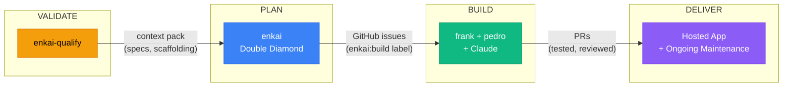
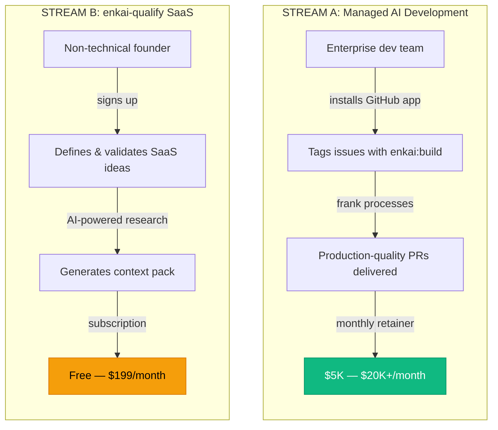
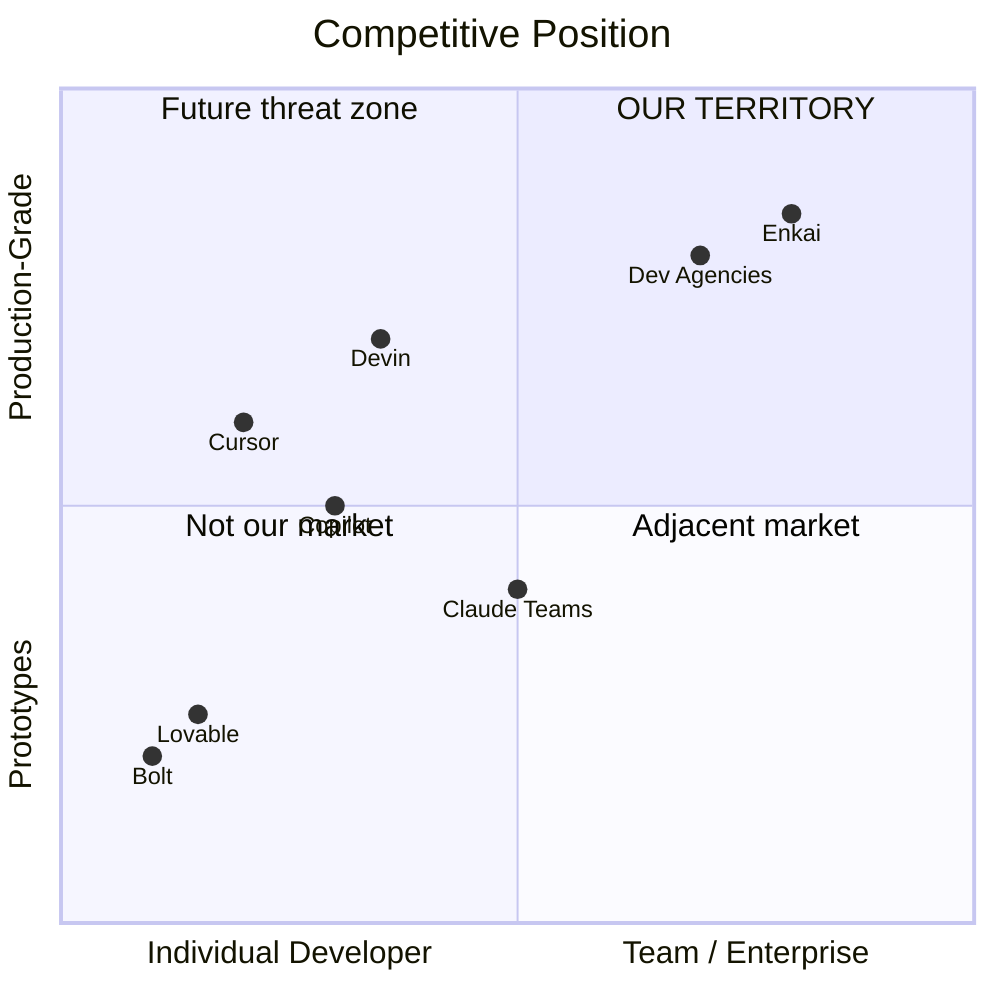

# VP Engineering Strategy Report

> **Date**: March 7, 2026
> **Period**: February 22 — March 7, 2026
> **Author**: VP Engineering Agent (Claude Opus 4.6)
> **Previous**: [vp-engineering-strategy-2026-02-24.md](vp-engineering-strategy-2026-02-24.md) *(superseded)*
> **Status**: Definitive revision — reflects actual business model, team structure, and revenue strategy

---

## Executive Summary

Enkai is a two-person bootstrapped Canadian company that has built an **AI-powered software factory** capable of producing enterprise-grade applications at extraordinary speed. Two founders + AI agents maintain 30+ active repositories, and enterprise prospects are already asking to buy.

```
 THE STRATEGIC SITUATION                    THE RECOMMENDATION
 ─────────────────────────                  ─────────────────────
 Revenue today .............. $0            Close 1 paid enterprise deal in 30 days
 Enterprise conversations ... 4 active      Launch enkai-qualify in 60 days
 Ready to move forward ...... 2 groups      Target: $20K/month by month 3-6
 Monthly burn ............... ~$2K AWS      Don't wait for "ready" — sell NOW
 Target income .............. $20K/month    Productize the platform LATER
```

**Core insight**: The platform already works — it built itself and 30+ other repos. The bottleneck isn't product readiness; it's closing deals.

---

## 1. What We Are

### 1.1 The Company

| | |
|---|---|
| **Entity** | Canadian corporation (Ltd.), equal partnership |
| **Founder 1** | Technical — coding, infrastructure, AI agent configuration |
| **Founder 2 (Jordan)** | UX/design, business development, customer-facing |
| **Team model** | 2 humans + AI agents (frank containers running Claude Code) |
| **Funding** | Bootstrapped; both founders employed full-time elsewhere |
| **Domain** | enkai.ca |
| **GitHub** | Migrating from tegryan-ddo to enkai-inc |

### 1.2 The Value Chain



| Stage | Tool | What Happens |
|-------|------|-------------|
| **Validate** | enkai-qualify | Research SaaS ideas, compare options, refine until confident, generate context pack |
| **Plan** | enkai | Import pack, double diamond design process, wireframes, specs, product fit filtering |
| **Build** | frank + pedro + claude | GitHub issue created, AI agent processes it, PR opened with tests and quality gates |
| **Deliver** | Hosted infrastructure | Continuous hosting, ongoing maintenance, feature iteration |

### 1.3 Proof Points

```
 30+  active repos receiving AI-generated PRs today
 100% of Enkai's own tools built by the enkai system
   4  enterprise conversations active
   2  groups ready to move forward
 500+ commits per week across the portfolio
```

### 1.4 What Prospects React To

> *"It's the speed, the productivity, the quality. It's the pace of PRs and the sheer size of things we're building. We're not building fancy webpages — we're actually building enterprise-level apps. People are realizing that AI will let an inexperienced person build something that looks good, but we're actually building the thing that works well."*

This is the pitch. This is the differentiator. Lean into it.

---

## 2. Revenue Strategy

### 2.1 Two Revenue Streams



#### Stream A: Managed AI Development (Enterprise B2B)

| | |
|---|---|
| **What** | Connect to client's GitHub, deliver production-quality PRs from tagged issues |
| **Target** | Enterprise dev teams wanting AI-augmented workflows |
| **Sales motion** | Jordan-led relationship selling; demo = show actual repos + PR history |
| **Timeline** | **Can start selling NOW** |

#### Stream B: enkai-qualify (SaaS)

| | |
|---|---|
| **What** | Structured process to validate, compare, and flesh out SaaS ideas; generates build packs |
| **Target** | Non-technical founders, indie hackers, product managers |
| **Sales motion** | Product-led growth, content marketing |
| **Timeline** | 60 days to public launch |

### 2.2 Pricing Framework

#### Managed AI Development (Stream A)

| Tier | Monthly | Included | Target |
|:-----|:-------:|----------|--------|
| **Pilot** | **$5,000** | 1 repo, ~20 issues/month, PR delivery, weekly sync | Team testing the model |
| **Growth** | **$10,000** | 3 repos, ~50 issues/month, PR delivery, planning UI access | Team adopting AI workflows |
| **Scale** | **$20,000+** | Unlimited repos, custom SLA, dedicated capacity, full platform | Org-wide AI adoption |

> **Pricing principles:**
> - Never bill hourly — your value is speed; hourly billing punishes it
> - Offer "Founding Customer" discount (20-30% off first 5 customers) in exchange for case study + testimonial
> - Include hosting at cost + margin for recurring revenue
> - 3-month minimum commitment for predictability

#### enkai-qualify (Stream B)

| Tier | Monthly | Included |
|:-----|:-------:|----------|
| **Free** | **$0** | 1 idea, basic research, no pack generation |
| **Builder** | **$29** | 5 ideas, full research, pack generation (enkai format) |
| **Pro** | **$79** | Unlimited ideas, comparison tools, multi-format packs |
| **Team** | **$199** | Everything + collaboration, shared idea libraries |

### 2.3 Path to $20K/month

```
                                    MONTHLY REVENUE
 ──────────────────────────────────────────────────────────────
 Month 1-2:  1 Growth customer ........................ $10,000
 Month 2-3:  + 1 Pilot customer .......................  $5,000
 Month 3-6:  + 50 qualify subscribers (avg $40) .......  $2,000
 Month 2+:   + clearbreak hosting/maintenance ..... $1,000-2,000
 ──────────────────────────────────────────────────────────────
 TOTAL (Month 3-6) .............................. $18,000-19,000
```

Two enterprise deals + qualify launch + clearbreak. That's the path.

---

## 3. Immediate Concerns

### 3.1 CRITICAL — Remove Fake Testimonials

The enkai.ca homepage has three fabricated testimonials:
- "Sarah Chen, Engineering Manager, TechFlow Inc."
- "Marcus Rodriguez, Senior Developer, DataSync Labs"
- "Emily Nakamura, CTO, Startup Ventures"

**These must be removed today.** Enterprise prospects do due diligence. Fabricated social proof destroys the trust that powers your entire pitch.

**Replace with:**
- A real quote from Andy about the clearbreak experience
- Anonymized feedback from developer evaluators
- Or remove the section entirely — "Currently in Early Access" builds more trust than fake praise

### 3.2 HIGH — Pricing Page Doesn't Match Service Model

The current pricing (Free / $49/seat/mo / Enterprise Custom) is structured as self-service SaaS. But the immediate revenue is **managed development services** — delivering PRs, not renting a platform.

**Action:** Add a "Managed Development" section or a separate "Services" page reflecting the retainer model. Enterprise prospects need to see pricing that matches what they're buying.

### 3.3 HIGH — Pipeline Stability

Six consecutive `fix(pipeline)` commits on the enkai monorepo (Mar 6-7). For a company selling development quality, the deploy pipeline must be reliable.

**Action:** One focused day to audit and stabilize the CDK deploy chain.

### 3.4 MEDIUM — Claude Subscription Ceiling

Two Claude Max 20x subscriptions work now but won't scale past ~3 concurrent enterprise customers. Plan the API billing transition when enterprise revenue can absorb it.

### 3.5 MEDIUM — MacBook Runner Migration

Smart cost optimization, but needs:
- Cloud fallback for when the MacBook is offline
- Monitoring/alerting
- Should NOT block revenue activities

---

## 4. 90-Day Plan

### Phase 1: Days 1-14 — Close First Deal + Fix Credibility

```
 P0  Remove fake testimonials from enkai.ca ................ You (TODAY)
 P0  Jordan contacts 2 ready enterprise groups with
     concrete proposal ($5K Pilot, 3-month commitment) ..... Jordan
 P1  Get real testimonial from Andy ........................ Jordan
 P1  Stabilize enkai deploy pipeline (1 focused day) ....... You
 P1  Define clearbreak delivery milestones ................. You + Andy
 P2  Complete org migration to enkai-inc ................... You
```

### Phase 2: Days 15-45 — First Revenue + Qualify Prep

```
 P0  Onboard first enterprise pilot customer
     (GitHub app install, repo connection, first PRs) ...... You
 P0  Ship clearbreak to production-ready state ............. You (via frank)
 P1  Define qualify public launch requirements
     (billing, landing page, onboarding) ................... You + Jordan
 P1  Add managed development pricing to enkai.ca ........... Jordan + You
 P1  Set up Stripe billing ................................. You
 P1  Start weekly customer sync with pilot ................. Jordan
```

### Phase 3: Days 45-90 — Scale to $20K/month

```
 P0  Close second enterprise deal .......................... Jordan
 P0  Launch enkai-qualify publicly with billing ............ You + Jordan
 P1  Gather pilot feedback and iterate ..................... Both
 P1  Begin content marketing (blog, LinkedIn) .............. Jordan
 P2  Automate frank lifecycle (auto-start on issue tag) .... You
 P2  SOC 2 readiness assessment ............................ You
```

### What We Explicitly Defer

```
 DEFERRED                              REASON
 ───────────────────────────────────────────────────────────────
 enkai UI overhaul                     Important but not revenue-blocking
 Bedrock pipeline (enkai-builder)      Revisit when multi-model needed
 enkai-relay features                  Maintenance mode
 New internal tools                    Use what exists, don't build more
 Self-service onboarding               Manual for first 5 customers
 Hiring                                Revisit at $20K/month sustained
```

---

## 5. Risk Assessment

| Risk | L | I | Mitigation |
|------|:-:|:-:|------------|
| Enterprise prospects stall | M | H | Jordan sends proposals THIS WEEK with expiring founding-customer discount |
| Founder time constraint (full-time jobs) | H | H | AI agents build; founders decide and sell. Protect evenings/weekends. |
| Claude subscription limits hit | M | M | Monitor usage. Enterprise revenue funds API migration. |
| Clearbreak drags on | M | M | Define hard milestones. Andy is a partner — set expectations. |
| Fake testimonials discovered | L* | **C** | Remove TODAY. *(Low only if acted on immediately)* |
| Qualify launch delayed by feature creep | M | M | Define MVP NOW. "Done > perfect" (Jordan is right). |
| Pipeline breaks during customer delivery | M | H | Stabilize this week. Add smoke tests. |
| Pricing too low | M | M | Start at recommended tiers. Easier to discount than raise. |
| Competition (Claude Teams / Cursor / Devin) | M | M | They're tools. We're a service + pipeline. Different model. |
| SOC 2 blocks enterprise deals | L | H | Start assessment Q2. "In progress" is acceptable for pilots. |

> **L** = Likelihood (L/M/H), **I** = Impact (L/M/H/C=Critical)

---

## 6. Competitive Positioning

### 6.1 Landscape



| Competitor | What They Do | How We Differ |
|------------|-------------|---------------|
| **Cursor / Copilot** | AI-assisted IDE for individuals | We deliver complete PRs to teams, not suggestions to individuals |
| **Devin** | Autonomous AI engineer | We have the full pipeline (validate -> design -> build); Devin is build-only |
| **Lovable / Bolt** | AI app builders for non-technical users | They build prototypes; we build production-grade apps with tests, CI/CD, security |
| **Dev agencies** | Human teams building software | We're 10x faster at a fraction of the cost |
| **Claude Teams** | AI chat for business teams | General-purpose; we're purpose-built with deep codebase context |

### 6.2 The One-Liner

> **Current:** "AI feature builder which delivers high-value PRs in a team setting"
>
> **Recommended:** "Enkai turns GitHub issues into production-ready, tested PRs — automatically."

### 6.3 The Moat

Your moat isn't technology — anyone can spin up Claude in a container. Your moat is:

1. **The process** — Double diamond + qualify pipeline + Pedro skills = structured, repeatable, high-quality
2. **The context management** — Feature Atlas, architecture maps, coding standards = agents that understand the codebase
3. **The proof** — 30+ repos built and maintained, including the system itself
4. **The expertise** — Deep domain knowledge in infrastructure, security, enterprise design
5. **First-mover in managed AI dev** — Competitors are tools. You're a service powered by proprietary tools.

---

## 7. Portfolio Overview

### Revenue Products

| Product | Description | Status |
|---------|------------|--------|
| **enkai** | AI feature builder — planning UI + GitHub-native build pipeline | Active development (core) |
| **enkai-qualify** | SaaS idea validator with context pack generation | Close to public launch |
| **clearbreak** | Mortgage calculator (first partner project, 50% equity) | Active development |

### Platform Infrastructure

| Product | Description | Status |
|---------|------------|--------|
| **frank** | AI agent container runtime (Go, ECS Fargate) | Production |
| **pedro** | Skills/config scaffolding, 30+ agent capabilities | Production |
| **enkai-infra** | Shared AWS infrastructure, 30+ CDK stacks | Active consolidation |
| **template-factory** | Project starter templates | Stable |

### Internal Tools

| Product | Description | Status |
|---------|------------|--------|
| **bankan** | Kanban board | Active |
| **brandassador** | Brand management | Backlog |
| **mockery** | Visual design mocking | Early |
| **vp** | VP Engineering strategy agent | Active |

### On Hold

| Product | Description | Reason |
|---------|------------|--------|
| **enkai-builder** | Bedrock-based build system | Not needed while frank+claude works |
| **enkai-issue-manager** | Issue analysis + dispatch | Disabled for cost reduction |
| **enkai-monitor** | Bedrock monitoring dashboard | Bedrock deprioritized |
| **enkai-relay** | Agent social network (fka pnyx) | Maintenance mode |
| **janus** | Deployment orchestration | Never started |

---

## 8. Two-Week Activity Log

### High Activity

| Repo | Key Changes |
|------|------------|
| **enkai** | 6 pipeline fixes (Mar 6-7), org migration (tegryan-ddo -> enkai-inc), domain migration (-> enkai.ca), pnyx -> enkai-relay rename, plan module features (status timeline, filter chips), 27 test fixes, disabled issue-manager + AgentCore |
| **enkai-qualify** | NEW — 501 commits, dashboard, pack downloads, S3 infrastructure, health endpoints |
| **clearbreak** | NEW — 32 commits, 8 dashboard pages, security hardening, Prisma migrations, auth |
| **enkai-infra** | 10+ stack migrations: logging, IAM, DNS (pnyx, frank), Redis, ECS cluster, DynamoDB/S3 |
| **frank** | Rightsized 4vCPU/8GB -> 2vCPU/4GB, IAM for qualify, removed model pin |
| **pedro** | Added /skill-eval, pnyx -> enkai-relay rename |

### Moderate Activity

| Repo | Key Changes |
|------|------------|
| **bankan** | Kanban board with teams, consolidated view, auth fix |
| **ja9** | Entry ID fixes, mobile layout improvements |
| **mockery** | Dashboard with 6 page mockups |

### Dormant (No changes in 2+ weeks)

enkai-builder, enkai-issue-manager, enkai-monitor, janus, template-factory, brandassador

---

## 9. Decision Log

| ID | Decision | Rationale | Status |
|:--:|----------|-----------|:------:|
| 001 | Focus Q1 on closing first paid enterprise deal + launching qualify | Revenue is the priority. Platform is proven across 30 repos. | NEW |
| 002 | Sell managed AI development (retainer), not platform access | Immediate revenue, lower friction, matches prospect expectations | NEW |
| 003 | Enterprise pricing: Pilot $5K, Growth $10K, Scale $20K+ | Targets $20K/month with 2-3 customers | NEW |
| 004 | Qualify pricing: Free / $29 / $79 / $199 | Low barrier. Revenue secondary to adoption. | NEW |
| 005 | No hiring until revenue exceeds $20K/month consistently | AI model works. Bottleneck is sales, not coding. | NEW |
| 006 | Remove fake testimonials immediately | Credibility risk is existential for enterprise sales | NEW |
| 007 | Defer: UI overhaul, Bedrock, enkai-relay, new tools, self-service | Focus. These wait until after first revenue. | NEW |
| 008 | Keep Claude subscriptions until 3+ concurrent enterprise customers | Cost-effective now. Revenue funds API migration later. | NEW |
| 009 | Jordan owns customer-facing; You own technical delivery | Clear split. Plays to strengths. | NEW |
| 010 | SOC 2 assessment in Q2, not Q1 | "In progress" is acceptable for pilots | NEW |

---

## 10. Open Questions

### Before First Enterprise Proposal

| # | Question | Why It Matters |
|:-:|----------|---------------|
| 1 | What's in the Pilot proposal? Want me to draft a one-pager for Jordan? | Jordan needs something concrete to send this week |
| 2 | Can you handle 2 enterprise customers + clearbreak + qualify simultaneously? | Validates the 90-day plan is realistic with day jobs |
| 3 | Who handles support when something breaks at 2am? | Enterprise customers expect defined support |

### Should Answer Soon

| # | Question | Why It Matters |
|:-:|----------|---------------|
| 4 | Is Jordan aligned on this strategy and pricing? | Both founders must agree before proposals go out |
| 5 | Should qualify target the same enterprises or a different market? | Determines whether qualify is a funnel or standalone business |
| 6 | How much of double diamond is automated vs. manual? | Determines scalability of the planning stage |

---

## 11. What I Need From You

```
 1. Confirm or adjust the pricing tiers
    → Are you comfortable proposing $5K/month to enterprise prospects?

 2. Tell Jordan to send proposals this week
    → The 2 groups who want to move forward need a concrete next step

 3. Remove the fake testimonials today
    → Non-negotiable for credibility

 4. Tell me about the enterprise prospects' industries/sizes
    → I can help tailor the proposals

 5. Want me to draft the enterprise pilot proposal one-pager?
    → I can have it ready for Jordan to send
```

---

<sub>Report generated by VP Engineering Agent (Claude Opus 4.6) | Session: vpeng-20260307 | Repos analyzed: 19 (tegryan-ddo) + 19 (enkai-inc)</sub>
