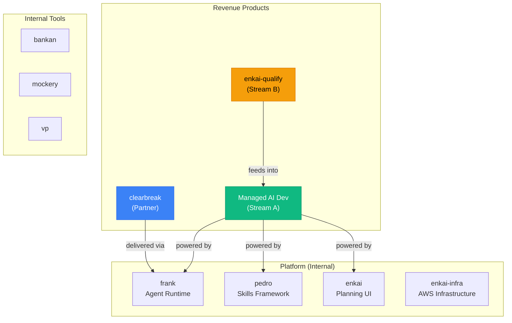

# VP Product Strategy Report

> **Date**: March 7, 2026
> **Period**: February 22 -- March 7, 2026
> **Author**: VP Product Agent (Claude Opus 4.6)
> **Status**: Initial report -- based on VP Engineering strategy context and business analysis

---

## Executive Summary

Enkai has two products approaching market but neither has a defined product strategy. The managed AI development service is being sold conversationally without a product spec. enkai-qualify has 501 commits but no public launch plan. The platform works -- 30+ repos prove it -- but "it works for us" is not a product strategy.

```
 THE SITUATION                              THE RECOMMENDATION
 ──────────────────────────                 ─────────────────────
 Products ................. 2 (+ 1 partner)  Define MVP scope for each NOW
 Product specs ............ None formal       Write 1-pagers before selling
 User research ............ 4 conversations   Structure these into discovery
 Onboarding flow .......... None              Design 48-hour time-to-value
 Feature prioritization ... Ad hoc            Ruthless: revenue-blocking only
 Product-market fit ....... Unvalidated       First pilot IS the validation
```

**Core insight**: You're selling before you've defined what you're selling. That works for deal #1. It won't work for deal #5. Define the product boundaries now while the team is small enough to align quickly.

---

## 1. Product Portfolio

### 1.1 Product Map



### 1.2 Product Status Assessment

| Product | Maturity | PMF Signal | Revenue Potential | Priority |
|---------|----------|-----------|-------------------|----------|
| **Managed AI Dev** | Service-ready, no product wrapping | 2 groups ready to buy | $10-20K/month | P0 |
| **enkai-qualify** | 501 commits, near-launch | Unvalidated | $2-5K/month (long-term) | P1 |
| **clearbreak** | Active dev, 32 commits | Partner validation | $1-2K/month | P1 |

---

## 2. Product #1: Managed AI Development

### 2.1 Current State

The "product" today is a capability, not a packaged offering. It works -- demonstrably -- but the customer experience is undefined:

- **No onboarding flow**: How does a customer go from "yes" to "first PR"?
- **No dashboard**: Customers can't see what's happening with their issues
- **No SLA definition**: What does "~20 issues/month" actually mean?
- **No quality metrics**: How do customers measure if this is working?
- **No feedback loop**: How do customers tell us something's wrong?

### 2.2 MVP Product Definition

**The minimum product for enterprise pilot**:

| Component | Must Have (Pilot) | Nice to Have (Growth) |
|-----------|------------------|----------------------|
| **Onboarding** | GitHub App install, codebase analysis, Feature Atlas generation | Self-service setup wizard |
| **Issue intake** | `enkai:build` label on GitHub issues | Priority labels, complexity estimates |
| **PR delivery** | Tested, linted PRs with quality gates | Auto-merge option, deployment |
| **Visibility** | Weekly email summary of work done | Real-time dashboard |
| **Communication** | Weekly 30-min sync call | Slack integration, async updates |
| **Quality** | PR includes tests, passes CI | Coverage reports, quality trends |
| **Feedback** | Email/Slack to report issues | In-PR feedback mechanism |

### 2.3 Customer Journey (Pilot)

```
 DAY 0     Contract signed. GitHub App install link sent.
 DAY 1     Codebase analysis begins. Feature Atlas generated.
           Customer receives "Your Codebase Profile" document.
 DAY 2     First test issue processed. PR delivered.
           Customer reviews and provides feedback on conventions.
 DAY 3-7   Calibration period. 3-5 issues processed with feedback loop.
           Conventions, patterns, and preferences documented.
 DAY 7     First weekly sync. Review quality, adjust approach.
 DAY 8-30  Steady state. ~5 issues/week processed.
           Weekly syncs continue.
 DAY 30    First monthly review. Metrics shared. Feedback collected.
 DAY 60    Pilot midpoint review. Go/no-go on continuation.
 DAY 90    Pilot conclusion. Case study discussion. Growth tier offer.
```

### 2.4 Success Metrics (Customer-Facing)

| Metric | Target | Measurement |
|--------|--------|-------------|
| Time to first PR | < 48 hours from setup | Tracked |
| PR acceptance rate | > 80% merged without major changes | GitHub data |
| Issues processed per month | Per tier commitment | Tracked |
| Customer satisfaction | > 8/10 at monthly review | Survey |
| Time saved per developer | > 10 hours/week | Customer estimate |

---

## 3. Product #2: enkai-qualify

### 3.1 Current State

501 commits, dashboard built, S3 infrastructure, health endpoints. But no public users and no launch plan.

### 3.2 MVP Scope (Public Launch)

**In scope for launch**:
| Feature | Status | Notes |
|---------|--------|-------|
| Idea creation and editing | Built | Core flow |
| AI-powered market research | Built | Using Claude |
| Competitive analysis | Built | Automated |
| Context pack generation | Built | Enkai format |
| User auth and accounts | Built | Cognito |
| S3 storage for packs | Built | Infrastructure ready |
| Stripe billing | Not built | Required for paid tiers |
| Landing page | Not built | Required for launch |
| Onboarding flow | Unknown | Needs assessment |

**Explicitly out of scope for launch**:
- Multi-format pack export (just enkai format)
- Team collaboration features
- API access
- Custom templates

### 3.3 User Personas

| Persona | Description | Job to Be Done | Tier |
|---------|-------------|----------------|------|
| **Indie Hacker Ian** | Solo founder, technical, wants to validate before building | "Help me figure out if this idea is worth building" | Free -> Builder |
| **Product Manager Pat** | PM at company, evaluating new product lines | "Give me a structured analysis I can present to leadership" | Pro |
| **Agency Owner Alex** | Runs dev shop, needs to scope client projects | "Help me research the market before quoting a project" | Pro -> Team |
| **Non-technical Nina** | Has domain expertise, no coding skills | "I know the problem. Help me define the solution." | Builder |

### 3.4 Qualify-to-Managed-Dev Funnel

The strategic value of qualify isn't just subscription revenue -- it's a **lead generation funnel** for managed AI development:

```
 Free tier user validates idea
       |
       v
 Builder tier generates context pack
       |
       v
 "Want us to build this?" CTA
       |
       v
 Managed AI Development pilot ($5K/month)
```

This funnel should be designed intentionally, not bolted on later.

---

## 4. Product #3: clearbreak (Partner)

### 4.1 Current State

Mortgage calculator with 32 commits, 8 dashboard pages, security hardening, Prisma, auth. 50% equity partnership with Andy.

### 4.2 Product Decisions Needed

| Decision | Options | Recommendation |
|----------|---------|---------------|
| Revenue model | Subscription / Lead gen / Freemium | Needs market research |
| Hosting | Enkai-managed / Self-hosted | Enkai-managed (recurring revenue) |
| Launch timeline | With qualify / Independent | Independent -- different market |
| Feature scope | Calculator only / Full mortgage toolkit | Start with calculator, expand based on usage |

### 4.3 clearbreak as Case Study

Regardless of clearbreak's own revenue, it's the **first external proof point** for the managed AI development service. Every design decision, PR, and deployment should be documented as evidence.

---

## 5. Feature Prioritization Framework

### 5.1 The Rule

At pre-revenue, every feature decision answers one question: **Does this help close an enterprise deal or launch qualify?**

If no, it waits.

### 5.2 Current Backlog Assessment

| Item | Revenue Impact | Effort | Verdict |
|------|---------------|--------|---------|
| GitHub App onboarding flow | Direct -- enterprise needs this | Medium | DO NOW |
| Weekly summary email | Direct -- customer visibility | Low | DO NOW |
| Qualify Stripe billing | Direct -- can't charge without it | Medium | DO NOW |
| Qualify landing page | Direct -- can't launch without it | Low | DO NOW |
| enkai UI overhaul | Indirect | High | DEFER |
| Multi-agent orchestration | None yet | Very High | DEFER |
| Bankan improvements | None | Medium | DEFER |
| Mockery features | None | Medium | DEFER |
| brandassador (18 issues) | None | High | DEFER |

### 5.3 Feature Freeze

Recommend a **feature freeze on all internal tools** (bankan, mockery, brandassador, vp improvements) until first enterprise deal closes. Every AI agent cycle should go toward revenue-generating work.

---

## 6. Product Principles

1. **Revenue before elegance**: Ugly that sells beats beautiful that doesn't
2. **Manual before automated**: Do things manually for customer #1, automate for customer #5
3. **GitHub-native**: Don't build UIs when GitHub already has one
4. **Transparency**: Customers should always know what's happening with their issues
5. **Time-to-value < 48 hours**: If a customer can't see value in 2 days, we've failed
6. **Eat our own cooking**: Every feature we sell must be one we use ourselves

---

## 7. Competitive Product Analysis

### 7.1 Feature Comparison

| Capability | Enkai | Cursor | Devin | Lovable | Dev Agency |
|-----------|:-----:|:------:|:-----:|:-------:|:----------:|
| Works in customer's repo | Yes | Yes | Yes | No | Sometimes |
| Full test suite included | Yes | No | Partial | No | Sometimes |
| CI/CD integration | Yes | No | No | No | Sometimes |
| Codebase context awareness | Deep | File-level | Repo-level | None | Manual |
| Design/planning phase | Yes | No | No | Yes | Yes |
| Ongoing maintenance | Yes | No | No | No | Billable |
| Human review required | Optional | Always | Sometimes | Always | Always |
| Price for 20 features/month | $5K | $20/seat | ~$500 | $20/seat | $30-50K |

### 7.2 Product Gaps to Close

| Gap | Competitor Advantage | Our Response | Timeline |
|-----|---------------------|-------------|----------|
| Real-time visibility | Cursor/Devin show work live | Weekly summary first, dashboard later | Q2 |
| Self-service onboarding | All competitors are self-service | Manual first, automate at customer #5 | Q3 |
| Multi-language support | Cursor/Copilot support everything | Focus on TS/React/Next.js, expand later | Q2 |
| Free trial | All competitors offer trials | Founding partner discount serves same purpose | N/A |

---

## 8. Roadmap

### 8.1 Next 30 Days (Revenue Sprint)

```
 WEEK 1
   Define managed dev onboarding flow (GitHub App -> first PR)
   Draft "Codebase Profile" template for customer Day 1
   Assess qualify readiness for Stripe integration

 WEEK 2
   Build weekly summary email template
   Define SLA language for pilot contract
   Begin qualify Stripe integration

 WEEK 3
   Test onboarding flow with clearbreak as guinea pig
   Qualify landing page copy and design
   Draft customer feedback survey template

 WEEK 4
   Onboarding flow ready for first enterprise customer
   Qualify billing ready for beta testers
   All sales collateral reviewed and finalized
```

### 8.2 Days 30-90

```
 MONTH 2
   Onboard first enterprise pilot
   Launch qualify to beta users (20 invites)
   Iterate based on pilot feedback
   Begin planning customer dashboard (for Growth tier)

 MONTH 3
   Second enterprise customer onboarding
   Qualify public launch
   First monthly metrics review with pilot customer
   Case study with clearbreak
```

---

## 9. Risk Assessment

| Risk | L | I | Mitigation |
|------|:-:|:-:|------------|
| Enterprise expectations exceed capability | M | H | Define scope tightly in contract. Under-promise, over-deliver. |
| Qualify launches to crickets | M | M | Pre-build waitlist. Product Hunt / HN launch strategy. |
| Clearbreak partnership misaligned on timeline | M | M | Set hard milestones with Andy. Monthly reviews. |
| Feature creep delays everything | H | H | Feature freeze on internal tools. Jordan's "done > perfect" rule. |
| No product feedback loop with customers | M | H | Weekly sync mandatory in pilot contract. Monthly survey. |
| Multi-language requests from prospects | M | M | Be transparent: "We're best at TS/React/Next.js. Expanding in Q2." |

---

## 10. Open Questions for Founders

| # | Question | Why It Matters |
|:-:|----------|---------------|
| 1 | What does the GitHub App install experience look like today? | Determines onboarding timeline |
| 2 | How long does Feature Atlas generation take for a new repo? | Sets customer expectations for Day 1 |
| 3 | What repo sizes/languages are the enterprise prospects using? | Determines technical readiness |
| 4 | Is qualify's dashboard consumer-ready or internal-quality? | Determines launch prep effort |
| 5 | What's Andy's timeline expectation for clearbreak? | Manages partner relationship |
| 6 | Should qualify packs be exportable to non-Enkai formats? | Determines if qualify is a funnel or standalone product |
| 7 | Are we ready to handle a customer whose CI we break? | Need incident response plan before pilot |
| 8 | Who monitors PR quality -- us or the customer? | Defines the ongoing service model |

---

## 11. What I Need From You

```
 1. Walk me through the GitHub App installation experience
    -> I need to design the onboarding flow

 2. Tell me the enterprise prospects' tech stacks
    -> TS/React/Next.js? Python? Java? This determines readiness

 3. Define "~20 issues/month" more precisely
    -> Size? Complexity? What counts as one issue?

 4. Confirm the qualify launch target: 60 days from now?
    -> I need to lock the scope and start the countdown

 5. Should I draft the pilot SLA and onboarding docs?
    -> These need to be ready before Jordan sends proposals
```

---

<sub>Report generated by VP Product Agent (Claude Opus 4.6) | Session: vpproduct-20260307</sub>
