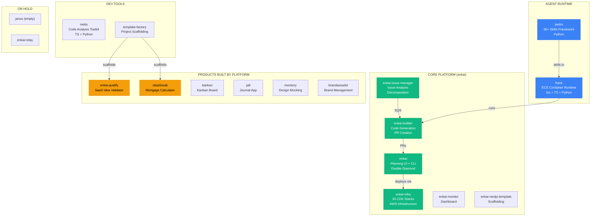

# VP Product Strategy Report

> **Date**: March 7, 2026
> **Period**: February 22 -- March 7, 2026
> **Author**: VP Product Agent (Claude Opus 4.6)
> **Status**: Initial report -- based on VP Engineering strategy context and portfolio analysis
> **Revision**: R1 -- corrected to center on enkai platform and full product portfolio

---

## Executive Summary

Enkai is a **platform company** with a 30+ repo product portfolio, but the platform itself lacks product definition. The enkai platform -- a 6-repo core (enkai, enkai-builder, enkai-issue-manager, enkai-infra, enkai-monitor, enkai-nextjs-template) powered by frank (agent runtime) and pedro (skills framework) -- is being sold conversationally as "managed AI development" without a product spec. Meanwhile, the portfolio it has built (clearbreak, bankan, ja9, mockery, brandassador, qualify) demonstrates its capability but isn't being leveraged strategically.

```
 THE SITUATION                              THE RECOMMENDATION
 ──────────────────────────                 ─────────────────────
 Core platform (enkai) ..... Works, no spec  Define MVP product boundaries NOW
 Portfolio products ........ 30+ repos       Categorize, prioritize, leverage
 User research ............. 4 conversations  Structure these into discovery
 Onboarding flow ........... None             Design 48-hour time-to-value
 Feature prioritization .... Ad hoc           Revenue-blocking only
 Product-market fit ........ Unvalidated      First pilot IS the validation
```

**Core insight**: The platform works -- it built itself and 30+ other products. But "it works for us" is not a product strategy. Define what enterprise customers get, what they don't, and what the product boundaries are.

---

## 1. Product Portfolio

### 1.1 Full Portfolio Map



### 1.2 Portfolio Status Assessment

#### Core Platform

| Component | Role | Status | Product Maturity |
|-----------|------|--------|-----------------|
| **enkai** | Planning UI, CLI, double diamond, schemas, Slack integration | Active (core) | Internal-quality -- needs enterprise hardening |
| **enkai-builder** | Code generation, PR creation, Bedrock AgentCore | Production | Core engine -- 6.3MB Python, 9+ JSON schemas |
| **enkai-issue-manager** | Issue analysis, decomposition, SQS dispatch | Production | Functional but disabled for cost reduction |
| **enkai-infra** | 30 CDK stacks (VPC, ECS, DynamoDB, SQS, S3, etc.) | Active consolidation | Mature infrastructure layer |
| **enkai-monitor** | Platform health dashboard | Stale (since Jan 30) | Needs assessment -- may need restart or replacement |
| **enkai-nextjs-template** | Starter template for new projects | Stable (5KB) | Minimal but functional |

#### Agent Runtime

| Component | Role | Status | Product Maturity |
|-----------|------|--------|-----------------|
| **frank** | ECS Fargate container runtime for AI agents, web UI, worktree isolation | Production | Multi-language (Go+TS+Python), recently rightsized |
| **pedro** | 30+ reusable agent skills | Production | Clean Python, consumed by frank at startup |

#### Dev Tools

| Component | Role | Status | Product Maturity |
|-----------|------|--------|-----------------|
| **metis** | AI-powered code analysis and quality checking | Active | Largest supporting repo (64MB) |
| **template-factory** | Project scaffolding from templates | Stable | Built on Pedro framework |

#### Products Built by Platform

| Product | Description | Status | Revenue Potential |
|---------|------------|--------|-------------------|
| **enkai-qualify** | SaaS idea validator with context pack generation | Near launch (501 commits) | $2-5K/month (SaaS) + lead funnel |
| **clearbreak** | Mortgage calculator (50% equity with Andy) | Active (32 commits, 8 pages) | $1-2K/month |
| **bankan** | Kanban board with teams, consolidated view | Active | Internal tool / demo asset |
| **ja9** | Journal app with entry management, mobile layout | Active | Internal tool / demo asset |
| **mockery** | Visual design mocking (6 page mockups) | Early | Internal tool / demo asset |
| **brandassador** | Brand management tooling | Backlog (18 open issues) | Internal tool |

#### On Hold

| Product | Reason |
|---------|--------|
| **janus** | Deployment orchestration -- planned but empty repo |
| **enkai-relay** | Agent social network -- maintenance mode |
| **enkai-builder (Bedrock)** | Bedrock pipeline not needed while frank+Claude works |

---

## 2. The Core Product: enkai Platform

### 2.1 What the Platform Actually Does

The enkai platform is a **complete AI software development pipeline**:

```
 GitHub Issue (tagged enkai:build)
       |
       v
 enkai-issue-manager
   - Analyzes issue requirements
   - Decomposes into work items
   - Dispatches via SQS
       |
       v
 enkai-builder (via frank container)
   - Receives job from SQS
   - Loads pedro skills (30+)
   - Analyzes codebase (Feature Atlas)
   - Plans via double diamond methodology
   - Writes code with tests (TDD)
   - Runs quality gates (lint, type-check, build)
   - Self-repairs on failure
       |
       v
 Pull Request delivered to customer's repo
   - Tests included
   - Quality gates passed
   - Architecture-aware
   - Convention-following
```

### 2.2 Current State: Enterprise Readiness Gaps

The platform works for internal use but has gaps for enterprise customers:

| Gap | Current State | Needed for Enterprise |
|-----|--------------|----------------------|
| **Onboarding** | Manual setup, no guided flow | GitHub App install -> codebase analysis -> first PR in 48 hours |
| **Visibility** | No customer-facing dashboard | Weekly summary email (minimum), dashboard (later) |
| **SLA** | "~20 issues/month" undefined | Clear issue size/complexity definitions, response times |
| **Quality metrics** | Internal only | Customer-facing quality dashboard showing PR acceptance rate, test coverage |
| **Feedback loop** | None | In-PR comments, weekly sync, monthly review |
| **Issue-manager** | Disabled for cost reduction | Needs re-enabling for enterprise customers |
| **Monitor** | Stale since Jan 30 | Needs assessment -- restart or replace? |

### 2.3 MVP Product Definition (Enterprise Pilot)

**The minimum product for enterprise pilot**:

| Component | Must Have (Pilot) | Nice to Have (Growth) |
|-----------|------------------|----------------------|
| **Onboarding** | GitHub App install, codebase analysis, Feature Atlas generation | Self-service setup wizard |
| **Issue intake** | `enkai:build` label on GitHub issues | Priority labels, complexity estimates, enkai-issue-manager auto-analysis |
| **PR delivery** | Tested, linted PRs with quality gates via enkai-builder | Auto-merge option, deployment |
| **Planning** | Double diamond for complex features via enkai CLI/UI | Customer access to planning UI |
| **Visibility** | Weekly email summary of work done | enkai-monitor dashboard (customer-facing) |
| **Communication** | Weekly 30-min sync call | Slack integration via enkai Slack module |
| **Quality** | PR includes tests, passes CI | Coverage reports, quality trends |
| **Agent runtime** | frank containers running enkai-builder | Dedicated frank capacity per customer |

### 2.4 Customer Journey (Pilot)

```
 DAY 0     Contract signed. GitHub App install link sent.
 DAY 1     frank container spins up. Codebase analysis begins.
           Feature Atlas generated. pedro skills loaded.
           Customer receives "Your Codebase Profile" document.
 DAY 2     First test issue processed via enkai-builder. PR delivered.
           Customer reviews and provides feedback on conventions.
 DAY 3-7   Calibration period. 3-5 issues processed.
           enkai-builder learns conventions via Feature Atlas.
           Patterns and preferences documented in pedro skills.
 DAY 7     First weekly sync. Review quality, adjust approach.
 DAY 8-30  Steady state. ~5 issues/week processed.
           Weekly syncs continue.
 DAY 30    First monthly review. Metrics shared. Feedback collected.
 DAY 60    Pilot midpoint review. Go/no-go on continuation.
 DAY 90    Pilot conclusion. Case study discussion. Growth tier offer.
```

### 2.5 Success Metrics (Customer-Facing)

| Metric | Target | Measurement |
|--------|--------|-------------|
| Time to first PR | < 48 hours from setup | Tracked via frank + enkai-builder |
| PR acceptance rate | > 80% merged without major changes | GitHub data |
| Issues processed per month | Per tier commitment | Tracked |
| Customer satisfaction | > 8/10 at monthly review | Survey |
| Time saved per developer | > 10 hours/week | Customer estimate |

---

## 3. Portfolio Products

### 3.1 Revenue Products

#### enkai-qualify (Lead Funnel + SaaS Revenue)

| Item | Details |
|------|---------|
| **Role in portfolio** | Lead generation funnel for managed dev + standalone SaaS revenue |
| **Status** | 501 commits, dashboard built, S3 infrastructure, health endpoints |
| **MVP remaining** | Stripe billing, landing page, onboarding assessment |
| **Priority** | P1 -- secondary to core platform enterprise readiness |
| **Key decision** | Is qualify a funnel into managed dev, or a standalone product? |

The qualify-to-managed-dev funnel:
```
 Free tier user validates idea -> Builder tier generates context pack
 -> "Want us to build this?" CTA -> Managed AI Development pilot ($5K/month)
```

#### clearbreak (Partner Project)

| Item | Details |
|------|---------|
| **Role in portfolio** | First external proof that the platform builds for others |
| **Status** | 32 commits, 8 dashboard pages, security hardening, Prisma, auth |
| **Equity** | 50% Enkai / 50% Andy |
| **Priority** | P1 -- case study value is as important as revenue |
| **Key decisions** | Revenue model, hosting arrangement, launch timeline |

### 3.2 Internal Tools (Demo Assets + Internal Productivity)

| Product | Status | Demo Value | Product Decision |
|---------|--------|-----------|-----------------|
| **bankan** | Active (teams, consolidated view, auth) | High -- tangible, relatable | Maintain for demos, don't invest heavily |
| **ja9** | Active (entry management, mobile layout) | Medium -- shows mobile capability | Maintain for demos |
| **mockery** | Early (6 page mockups) | Medium -- shows design capability | Maintain for demos |
| **brandassador** | Backlog (18 open issues) | Low -- not demo-ready | Freeze until revenue |

### 3.3 Platform Infrastructure (Not Customer-Facing, But Critical)

| Product | Product Decision |
|---------|-----------------|
| **frank** | Keep investing -- this IS the agent runtime that powers enterprise delivery |
| **pedro** | Keep investing -- skills quality directly impacts PR quality |
| **enkai-infra** | Stabilize -- 30 CDK stacks need consolidation, but not a product blocker |
| **metis** | Assess -- is this used actively or redundant with pedro skills? |
| **template-factory** | Stable -- no investment needed |

### 3.4 On Hold (Correct Decisions)

| Product | Decision | Rationale |
|---------|----------|-----------|
| **janus** | Keep on hold | Deployment orchestration is nice-to-have, not revenue-blocking |
| **enkai-relay** | Keep on hold | Agent social network -- interesting but not revenue-generating |
| **enkai-builder (Bedrock)** | Keep on hold | frank+Claude works. Revisit when multi-model needed |
| **enkai-issue-manager** | Re-evaluate | Was disabled for cost -- but may be needed for enterprise pilot |

---

## 4. Feature Prioritization Framework

### 4.1 The Rule

At pre-revenue, every feature decision answers one question: **Does this help the enkai platform close an enterprise deal?**

If no, it waits. Qualify, clearbreak, and internal tools all wait behind core platform enterprise readiness.

### 4.2 Current Backlog Assessment

| Item | Revenue Impact | Effort | Verdict |
|------|---------------|--------|---------|
| **Enkai platform onboarding flow** | Direct -- enterprise can't start without it | Medium | DO NOW |
| **Re-enable enkai-issue-manager** | Direct -- auto-analyzes customer issues | Medium | ASSESS |
| **Weekly summary email from platform** | Direct -- customer visibility | Low | DO NOW |
| **enkai-monitor restart** | Direct -- customer dashboard (Growth tier) | Medium | ASSESS |
| **Qualify Stripe billing** | Revenue-enabling (secondary stream) | Medium | DO SOON |
| **Qualify landing page** | Revenue-enabling (secondary stream) | Low | DO SOON |
| **enkai planning UI hardening** | Indirect -- demo asset for enterprise sales | Medium | DO SOON |
| **frank dedicated capacity** | Enterprise -- per-customer container isolation | Medium | DO SOON |
| **enkai UI overhaul** | Indirect | High | DEFER |
| **Multi-agent orchestration** | None yet | Very High | DEFER |
| **Bankan improvements** | None | Medium | DEFER |
| **Mockery features** | None | Medium | DEFER |
| **brandassador (18 issues)** | None | High | FREEZE |
| **janus** | None | Very High | FREEZE |

### 4.3 Feature Freeze

**Frozen** (no AI agent cycles until first enterprise deal closes):
- brandassador (18 issues can wait)
- janus (planned but not needed)
- enkai-relay (maintenance mode, keep it there)
- mockery (beyond current state)
- ja9 (beyond current state)

**Active maintenance only** (bugs, no new features):
- bankan
- metis
- template-factory

---

## 5. Product Principles

1. **Platform first**: The enkai platform IS the product. Everything else is either powered by it or feeds into it.
2. **Revenue before elegance**: Ugly that sells beats beautiful that doesn't
3. **Manual before automated**: Do things manually for customer #1, automate for customer #5
4. **GitHub-native**: Don't build UIs when GitHub already has one
5. **Transparency**: Customers should always know what's happening with their issues
6. **Time-to-value < 48 hours**: If a customer can't see value in 2 days, we've failed
7. **Eat our own cooking**: Every feature we sell must be one we use on our own portfolio

---

## 6. Competitive Product Analysis

### 6.1 Feature Comparison

| Capability | Enkai Platform | Cursor | Devin | Lovable | Dev Agency |
|-----------|:-----:|:------:|:-----:|:-------:|:----------:|
| Works in customer's repo | Yes | Yes | Yes | No | Sometimes |
| Issue analysis + decomposition | Yes (issue-manager) | No | Partial | No | Manual |
| Design/planning phase | Yes (double diamond) | No | No | Yes | Yes |
| Full test suite included | Yes (enkai-builder TDD) | No | Partial | No | Sometimes |
| CI/CD integration | Yes (5 GitHub Actions) | No | No | No | Sometimes |
| Codebase context (Feature Atlas) | Deep | File-level | Repo-level | None | Manual |
| Agent runtime isolation | Yes (frank/ECS) | N/A | Yes | N/A | N/A |
| Reusable skills library | Yes (pedro, 30+) | No | No | No | No |
| Infrastructure management | Yes (30 CDK stacks) | No | No | No | Manual |
| Ongoing maintenance | Yes | No | No | No | Billable |
| Portfolio proof | 30+ repos | N/A | Demo only | Demo only | Client list |
| Price for 20 features/month | $5K | $20/seat | ~$500 | $20/seat | $30-50K |

### 6.2 Product Gaps to Close

| Gap | Competitor Advantage | Our Response | Timeline |
|-----|---------------------|-------------|----------|
| Real-time visibility | Cursor/Devin show work live | Weekly summary first, enkai-monitor dashboard later | Q2 |
| Self-service onboarding | All competitors are self-service | Manual first, automate at customer #5 | Q3 |
| Multi-language support | Cursor/Copilot support everything | Focus on TS/React/Next.js (matches portfolio), expand later | Q2 |
| Free trial | All competitors offer trials | Founding partner discount + clearbreak/bankan as demos | N/A |

---

## 7. Roadmap

### 7.1 Next 30 Days (Platform Revenue Sprint)

```
 WEEK 1
   Define enkai platform onboarding flow (GitHub App -> frank -> first PR)
   Assess: re-enable enkai-issue-manager for enterprise?
   Assess: restart enkai-monitor or build lightweight alternative?
   Draft "Codebase Profile" template for customer Day 1

 WEEK 2
   Build weekly summary email from enkai-builder output
   Define SLA language for pilot contract (issue sizes, response times)
   Begin qualify Stripe integration (secondary priority)

 WEEK 3
   Test onboarding flow with clearbreak as guinea pig
   Verify frank can handle dedicated per-customer containers
   Qualify landing page copy and design
   Draft customer feedback survey template

 WEEK 4
   Platform onboarding flow ready for first enterprise customer
   Qualify billing ready for beta testers
   All sales collateral reviewed and finalized
   Portfolio demo curated (top 3-4 products selected)
```

### 7.2 Days 30-90

```
 MONTH 2
   Onboard first enterprise pilot via enkai platform
   frank dedicated container running for customer
   enkai-builder processing customer issues
   Weekly syncs, adjust pedro skills based on feedback
   Launch qualify to beta users (20 invites)

 MONTH 3
   Second enterprise customer onboarding
   First monthly metrics review with pilot customer
   Qualify public launch
   Case study with clearbreak
   Assess: is enkai planning UI ready for customer access? (Growth tier feature)
```

---

## 8. Risk Assessment

| Risk | L | I | Mitigation |
|------|:-:|:-:|------------|
| Enterprise expectations exceed platform capability | M | H | Define scope tightly in contract. Under-promise, over-deliver. |
| enkai-issue-manager re-enablement causes cost spike | M | M | Start with manual issue tagging. Re-enable only when revenue supports it. |
| enkai-monitor too stale to restart | M | M | Assess first. May need lightweight replacement. |
| frank can't isolate per-customer containers | L | H | Already supports worktree isolation. Test with clearbreak first. |
| Clearbreak partnership misaligned on timeline | M | M | Set hard milestones with Andy. Monthly reviews. |
| Feature creep across 30+ repos | H | H | Feature freeze on non-revenue products. Enforce ruthlessly. |
| No product feedback loop with customers | M | H | Weekly sync mandatory in pilot contract. Monthly survey. |
| Portfolio products embarrass in demos | M | M | Curate top 3-4 only. Ensure they're clean before showing. |

---

## 9. Open Questions for Founders

| # | Question | Why It Matters |
|:-:|----------|---------------|
| 1 | What does the enkai GitHub App install experience look like today? | Determines onboarding timeline |
| 2 | How long does Feature Atlas generation take for a new repo? | Sets customer expectations for Day 1 |
| 3 | Why was enkai-issue-manager disabled? What's the cost to re-enable? | Key platform component -- need to decide if it's in the MVP |
| 4 | What's the state of enkai-monitor? Salvageable or start fresh? | Customer dashboard is a Growth tier feature |
| 5 | Can frank handle per-customer container isolation today? | Required for enterprise security |
| 6 | What repo sizes/languages are the enterprise prospects using? | Determines platform readiness |
| 7 | Which portfolio products are demo-ready right now? | Need to curate the portfolio showcase |
| 8 | Is the enkai planning UI (double diamond) ready to show prospects? | Best demo asset if it's polished enough |
| 9 | What's Andy's timeline expectation for clearbreak? | Manages partner relationship |
| 10 | Should enkai-qualify be a funnel into managed dev, or standalone? | Determines product strategy for qualify |

---

## 10. What I Need From You

```
 1. Walk me through the enkai platform pipeline end-to-end
    -> I need to map: issue in -> issue-manager -> builder -> PR out

 2. Tell me the enterprise prospects' tech stacks
    -> TS/React/Next.js? Python? Java? This determines platform readiness

 3. Explain why enkai-issue-manager was disabled
    -> Need to decide: re-enable for enterprise, or manual intake?

 4. Define "~20 issues/month" more precisely
    -> Size? Complexity? What counts as one issue vs. an epic?

 5. Which portfolio products can I see? (bankan, ja9, clearbreak, qualify)
    -> Need to assess demo readiness across the portfolio

 6. Should I draft the pilot SLA and onboarding docs?
    -> These need to be ready before Jordan sends proposals
```

---

<sub>Report generated by VP Product Agent (Claude Opus 4.6) | Session: vpproduct-20260307 | R1</sub>
